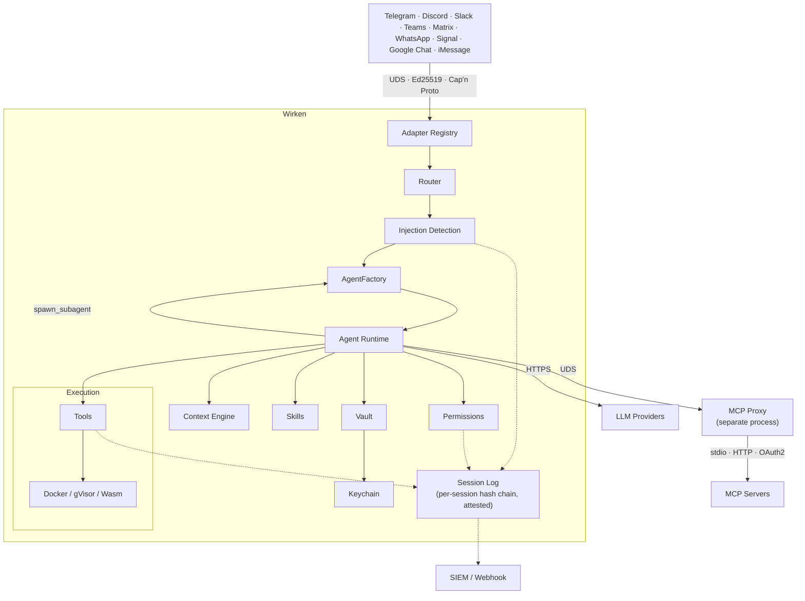

# Wirken

**Wirken is AI agents on your chat tools, done the way it should have been from the start: self-hosted, channel-isolated, every action audited.**

Organizations deploy AI agents across Telegram, Discord, Slack, Microsoft Teams, Matrix, WhatsApp, Signal, Google Chat, and iMessage. Every message crosses a trust boundary between the channel that delivered it, the orchestrator that routed it, and the inference provider that answered it. Most agent frameworks collapse these boundaries into a single trust domain with one token, no process isolation, and no audit trail. If that process is compromised, every channel is compromised with it.

Wirken separates the trust domains. Each channel runs in its own adapter process with a distinct ed25519 IPC identity and its own vault-scoped token set. Credentials sit in an XChaCha20-Poly1305 vault keyed from the OS keychain, with per-credential expiry and manual rotation tracked in the store. Every agent action, tool call, LLM request, and response is written to a per-session SHA-256 hash-chained audit log. The log forwards to Datadog, Splunk, or a webhook when SIEM is configured. Permissions follow a three-tier model scoped per agent. Parent agents that spawn children declare per-child ceilings: tool allowlist, maximum permission tier, max rounds, max runtime.

Wirken is self-hosted and ships as a single static Rust binary. It runs against Ollama, Anthropic, OpenAI, Gemini, Bedrock, Tinfoil, Privatemode, or any OpenAI-compatible endpoint. Point it at a Hetzner GPU box running a self-hosted model, a local Ollama install, or a hosted API. MIT licensed.

## Install and run

Download the latest release binary:

```bash
curl -fsSL https://raw.githubusercontent.com/gebruder/wirken/main/install.sh | sh

wirken setup
wirken run
```

Pin the installer before piping. The committed `install.sh` has this SHA-256:

```
e5e8779155aab24c1d7fe0c41bc93d23b18ddd8293e48b01d19dc58b44aec7b8
```

Verify it yourself:

```bash
curl -fsSL https://raw.githubusercontent.com/gebruder/wirken/main/install.sh | sha256sum
```

The installer then fetches `checksums.sha256` and `checksums.sha256.sig` from the release, verifies the signature with `ssh-keygen -Y verify` against a signing key embedded in the script, and verifies the binary's SHA-256 against the signed checksums. Every failure path is fail-closed: missing signature, missing checksum, mismatched digest, or a machine without `sha256sum`/`shasum` aborts install. The only override is `WIRKEN_ALLOW_UNVERIFIED=1`, which warns on stderr and is documented in [docs/release-signing.md](docs/release-signing.md).

Prebuilt binaries are available for Linux (x86_64, aarch64) and macOS (x86_64, Apple Silicon). The Linux binaries are statically linked against musl with no glibc dependency.

Or build from source (requires Rust 1.85+ and the `capnp` compiler):

```bash
# Ubuntu/Debian
sudo apt-get install -y capnproto

# macOS
brew install capnp

cargo install --path crates/cli
```

`wirken setup` walks you through three steps:

```
  wirken setup
  ────────────

  Step 1: Pick your AI
  Provider: Ollama (local) / Anthropic / OpenAI / Google Gemini / AWS Bedrock / Tinfoil / Privatemode / Custom endpoint
  API key: ********
  Encrypting API key...
  API key encrypted and stored.
  Model: gpt-4.1-mini               ← auto-detected from provider API

  Step 2: Pick your channels
  Add a channel: Telegram
  Telegram bot token: ********
  telegram: token encrypted, adapter keypair generated, registered.

  Setup complete!
  Provider: openai (gpt-4o)
  Channels: telegram
```

`wirken run` starts the gateway daemon. It spawns adapter processes, accepts authenticated connections, routes messages to the agent, and serves a WebChat UI at `http://localhost:18790`:

```
  wirken gateway v0.7.1
  ──────────────

  Provider: ollama/llama3.2
  Ollama version: 0.19.0
  Route: telegram -> agent:default
  Socket: ~/.wirken/sockets/gateway.sock
  WebChat: http://localhost:18790

  Gateway running. Press Ctrl+C to stop.
```

All local services bind to 127.0.0.1. Wirken never instructs you to bind inference servers, WebChat, or any local endpoint to 0.0.0.0.

Install as a system service so the gateway starts on login:

```bash
wirken setup --install-service
```

## Architecture



Each channel adapter runs as a separate OS process. Adapters authenticate to the gateway with a per-adapter Ed25519 challenge-response handshake over a Unix domain socket. Messages are serialized with Cap'n Proto (zero-copy, traversal-limited). An adapter can only deliver inbound messages for its own channel and request outbound sends for its own channel. It cannot invoke tools, read other channels' sessions, or access other channels' credentials.

Channel isolation operates at two levels. The active mechanism is process-level: each channel runs in its own OS process with a distinct ed25519 identity. The IPC crate also defines a sealed `Channel` trait and `SessionHandle<C: Channel>` type that makes cross-channel handle conversions a compile error. This type-level API is not yet threaded through the production message path, where the channel discriminator is a string field on the Cap'n Proto inbound frame. If an adapter process is compromised, the blast radius is exactly one channel because the gateway's IPC boundary, running in a separate memory-safe process, prevents lateral movement.

The MCP proxy also runs out-of-process over a Unix domain socket, with the vault handle isolated in the proxy. MCP servers connect via stdio, HTTP, or OAuth2, and the agent process never sees MCP credentials.

Agents are stateless between turns. The `AgentFactory` wakes an agent for each inbound message by replaying its session log. Conversations are durably logged as typed session events (user messages, assistant messages, tool calls, tool results, LLM request/response metadata) in an append-only, per-session hash-chained table. If the agent crashes mid-turn, the harness detects incomplete tool rounds on wake and surfaces them as failures rather than silently re-executing side effects. A context engine trims conversations under each model's token budget before every LLM call, preferring to drop old tool results before touching user or assistant text.

Agents can delegate bounded subtasks to child agents via `spawn_subagent`. The operator configures a per-child capability ceiling (tool allowlist, max permission tier, max rounds, max runtime). Children run headless with no interactive approvals, isolated session logs, and a hard depth cap of 4.

## Security properties

- **Session attestation.** Per-agent Ed25519 identity signs the per-session hash chain after every turn. `wirken session verify` replays the log offline and re-checks message hashes, deterministic tool results, and chain integrity. Tampered sessions break the chain.
- **Reproducible replay.** Every LLM call is recorded as a typed session event with a SHA-256 hash of the exact messages and tools sent. The verifier recomputes these hashes from the log and flags any divergence.
- **Per-channel process isolation.** Each channel adapter runs in its own OS process with a distinct ed25519 identity. Type-level channel separation (`SessionHandle<Telegram>` vs `SessionHandle<Discord>`) exists in the IPC crate and is regression-tested but not yet used in the production message path.
- **Out-of-process credential isolation.** MCP credentials (bearer tokens, OAuth2 client secrets) live in a separate proxy process. The agent process never sees them. The vault is XChaCha20-Poly1305, keyed from the OS keychain; `secrecy` + `zeroize` make logging a secret a compile error.
- **Capability-attenuated multi-agent.** The LLM cannot widen a child agent's permissions. The operator sets the ceiling; the harness intersects, clamps, and enforces. Children run headless with no interactive approvals.

Full OWASP and NIST AI RMF mappings: [docs/security-properties.md](docs/security-properties.md)

## Enterprise deployment

Wirken gives organizations the controls they need to deploy AI agents without bypassing existing security, compliance, and audit requirements.

- **Full attribution.** Every inbound message records the platform sender id, channel, session, and agent. Permission decisions are scoped per agent, not per user. Typed session events record what action ran, when, and on which target.
- **Tamper-evident audit trail.** All actions logged as typed session events before execution. Per-session SHA-256 hash chain detects modification or deletion. Per-agent Ed25519 attestation signs the chain head after every turn. `wirken session verify` replays the log offline and re-checks hashes. SIEM forwarding sends events to Datadog, Splunk, or any webhook in real time.
- **Crash recovery.** Agents are stateless between turns. The harness replays the session log on wake. Incomplete tool rounds are detected and surfaced as failures rather than silently re-executed.
- **Graduated permissions.** Three-tier model. Workspace file access and web search are always allowed. Shell exec and external file access require first-use approval. Destructive operations, credential access, and skill installs always require explicit approval. Approvals expire after 30 days.
- **Capability-attenuated multi-agent.** Parent agents delegate to children via `spawn_subagent` under operator-configured ceilings (tool allowlist, max permission tier, max rounds, max runtime). Children run headless with isolated session logs. Hard depth cap of 4.
- **Sandboxed execution.** Optional Docker sandbox runs agent commands in ephemeral containers with no network access, memory and PID limits, and a non-root user. gVisor runtime available for kernel attack surface reduction. Sandbox provisioning is lazy, so there is no startup cost when unused.
- **Context management.** A per-model context engine trims conversations under token budgets before every LLM call, preferring to drop old tool results before touching user or assistant text. Structured compaction events are written to the session log and projected back into the prompt so the model knows what was trimmed.
- **Prompt injection detection.** Inbound messages are scanned for role-switching attempts, instruction overrides, base64-encoded commands, tool-call injection, and system prompt extraction. Detected threats are flagged in the session log and forwarded to SIEM; messages are not blocked.
- **Confidential inference.** Tinfoil and Privatemode providers run LLMs inside hardware enclaves (AMD SEV-SNP, Intel TDX). Prompts are encrypted end-to-end and protected against software attacks on infrastructure.
- **Encrypted credentials.** XChaCha20-Poly1305 vault keyed from the OS keychain. Per-credential expiry and rotation. No plaintext export. MCP credentials are isolated in a separate proxy process.
- **Centralized policy.** `wirken setup --org https://wirken.corp.example.com` pulls provider, SIEM, MCP, and permission config from a company endpoint. Developers get grab-and-go setup. IT manages one config. Policy refreshes on every `wirken run`.

## Documentation

- [Getting started](docs/getting-started.md)
- [Deploying for teams](docs/deploying-for-teams.md) (shared inference, per-channel adapters, current limitations)
- [Permissions and identity](docs/permissions-and-identity.md) (what exists today, what is planned)
- [CLI reference](docs/cli.md)
- [Configuration reference](docs/configuration.md)
- [Channel setup](docs/channels.md) (Telegram, Discord, Slack, Teams, Matrix, Signal, Google Chat, iMessage)
- [Multi-agent setup](docs/multi-agent.md)
- [Skills guide](docs/skills.md) (markdown skills, Wasm skills, registry)
- [MCP setup](docs/mcp.md)
- [Security properties](docs/security-properties.md) (OWASP and NIST AI RMF mappings)
- [Enterprise deployment](docs/enterprise.md) (org config, SIEM, sandbox)
- [Migration from OpenClaw](docs/migration.md)
- [Troubleshooting](docs/troubleshooting.md)
- [Architecture](docs/architecture.md)
- [Enforcement model](docs/enforcement-model.md) (compile-time vs. runtime guarantees)
- [Release process](docs/release-process.md) (version bump, tag, sign, publish, smoke test)
- [Release signing](docs/release-signing.md) (Ed25519 key, rotation, verification)

## Contributing

Wirken is a Rust workspace. All crates compile and test independently:

```bash
cargo test                        # full test suite
cargo test -p wirken-vault        # test one crate
cargo build -p wirken-cli         # build the binary
```

Building from source requires the Cap'n Proto compiler (`capnproto` package on Ubuntu, `capnp` via Homebrew on macOS).

The architecture is documented in [docs/architecture.md](docs/architecture.md).

**Adapter contributions are especially welcome.** Each adapter is an independent crate (`crates/adapter-<channel>/`) that implements the same IPC contract: connect to the gateway UDS, perform Ed25519 handshake, convert platform messages to/from Cap'n Proto frames. See any existing adapter for the pattern (Telegram is the simplest; Teams shows the HTTP webhook variant).

## Status

Wirken 0.7.x is the current series. 0.7 gets fixes and features; 0.6 gets security fixes only.

- **9 channel adapters** under `crates/adapter-*`: Telegram, Discord, Slack, Microsoft Teams, Matrix, WhatsApp, Signal, Google Chat, iMessage.
- **8 LLM providers** in `crates/agent/src/llm.rs`: Ollama, Anthropic, OpenAI, Google Gemini, AWS Bedrock, Tinfoil, Privatemode, plus a `custom` provider for any OpenAI-compatible endpoint.
- **15 bundled skills** under `skills/`.
- **452 tests** in the workspace, all green on main (`cargo test --workspace`).
- **Signed releases.** `checksums.sha256` is signed offline with an Ed25519 SSH key. `install.sh` embeds the public key inline, fetches `checksums.sha256.sig` from the release, and fails closed on any verification failure. See [docs/release-signing.md](docs/release-signing.md) and [KEYS](KEYS).

## The name

Wirken: German, *to work*, *to weave*, *to have effect*. Named for [Gebruder Ottenheimer](https://gebruder.ottenheimer.app/briefs/wirken.html), a weaving mill in Wurttemberg, 1862-1937.

## License

MIT
