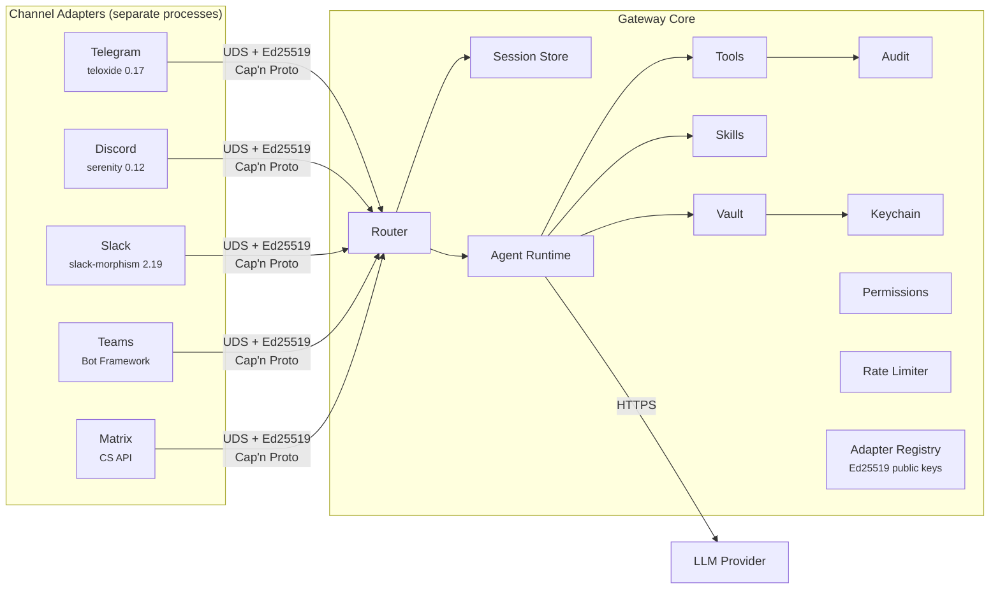

# Wirken

Wirken is a secure, model-agnostic personal AI agent gateway. It connects to the messaging platforms you already use — Telegram, Discord, Slack, Microsoft Teams, Matrix — and routes conversations to an LLM agent that can execute tools on your behalf. Written in Rust. Each channel runs as an isolated process with its own Ed25519 identity, communicating with the gateway over Unix domain sockets using Cap'n Proto. Credentials are encrypted at rest with XChaCha20-Poly1305, keyed from the OS keychain. Every agent action — every tool invocation, every message sent, every credential access — is logged to an append-only hash-chained audit trail before execution. Ships as a single static binary.

## Install and run

Download the latest release binary:

```bash
curl -fsSL https://raw.githubusercontent.com/gebruder/wirken/main/install.sh | sh

wirken setup
wirken run
```

Prebuilt binaries are available for Linux (x86_64, aarch64) and macOS (x86_64, Apple Silicon). The Linux binaries are statically linked against musl — no glibc dependency.

Or build from source (requires Rust 1.85+ and the `capnp` compiler):

```bash
cargo install --path crates/cli
```

`wirken setup` walks you through three steps:

```
  wirken setup
  ────────────

  Step 1: Pick your AI
  Provider: OpenAI / Anthropic / Google Gemini / AWS Bedrock / Tinfoil / Privatemode / Ollama (local) / Custom endpoint
  Model: gpt-4o
  API key: ********
  Encrypting API key...
  API key encrypted and stored.

  Step 2: Pick your channels
  Add a channel: Telegram
  Telegram bot token: ********
  telegram: token encrypted, adapter keypair generated, registered.

  Setup complete!
  Provider: openai (gpt-4o)
  Channels: telegram
```

`wirken run` starts the gateway daemon. It spawns adapter processes, accepts authenticated connections, routes messages to the agent, and serves a WebChat UI at `http://localhost:18790`:

```
  wirken gateway
  ──────────────

  Provider: openai/gpt-4o
  Route: telegram -> agent:default
  Socket: ~/.wirken/sockets/gateway.sock
  WebChat: http://localhost:18790

  Gateway running. Press Ctrl+C to stop.
```

Install as a system service so the gateway starts on login:

```bash
wirken setup --install-service
```

## Architecture



Each channel adapter runs as a separate OS process. Adapters authenticate to the gateway with a per-adapter Ed25519 challenge-response handshake over a Unix domain socket. Messages are serialized with Cap'n Proto (zero-copy, traversal-limited). An adapter can only deliver inbound messages for its own channel and request outbound sends for its own channel. It cannot invoke tools, read other channels' sessions, or access other channels' credentials.

This isolation is enforced at the type level. Session handles are parameterized by a channel marker type (`SessionHandle<Telegram>`), and the Rust compiler rejects any attempt to use a Telegram session handle in a Discord context. If an adapter process is compromised, the blast radius is exactly one channel — the gateway's IPC boundary, running in a separate memory-safe process, prevents lateral movement.

## Security properties

Designed against the [OWASP Top 10 for Agentic AI](https://genai.owasp.org/resource/agentic-ai-threats-and-mitigations/).

| OWASP | Threat | Mitigation |
|-------|--------|------------|
| AG01 | Excessive agency | Three-tier permission model. Tier 1 (always allowed): workspace file access, web search. Tier 2 (first-use approval, remembered 30 days): shell exec, external file access. Tier 3 (always prompt): destructive ops, credential access, network requests, skill install. |
| AG02 | Code execution | Optional Docker sandbox: ephemeral containers, no-network, 512MB memory, 256 PID limit, non-root user. Shell exec timeout at 300s; process killed on expiry. |
| AG04 | Tool misuse | Tool inputs validated against JSON schema. Workspace path confinement — file operations canonicalized and rejected if outside workspace boundary. |
| AG05 | Identity spoofing | Per-adapter Ed25519 challenge-response handshake over Unix domain sockets. Compile-time channel isolation — `SessionHandle<Telegram>` and `SessionHandle<Discord>` are different types; the compiler rejects cross-channel access. |
| AG07 | Multi-agent manipulation | Each channel adapter runs as a separate OS process. If an adapter is compromised, the blast radius is one channel. IPC boundary prevents lateral movement. |
| AG08 | Runaway loops | Agent tool call loop capped at 20 rounds per turn. Shell exec timeout at 300s. Rate limiting on all sources including loopback — no localhost exemption. |
| AG09 | Insufficient logging | Every agent action logged to an append-only SQLite log before execution. SHA-256 hash chain for tamper detection. 90-day retention with configurable pruning. |
| — | Credential security | XChaCha20-Poly1305 encryption at rest, keyed from OS keychain (macOS Keychain / libsecret / age fallback). Per-credential expiry and rotation. `secrecy` + `zeroize` — logging or serializing a secret is a compile error. Key material zeroed after use. |
| — | Transport security | HTTPS enforced at transport level for all LLM and Matrix connections (non-localhost). Cap'n Proto IPC with 16MB frame limit, 512M word traversal limit, 64-level nesting limit. |
| — | Supply chain | Skill signatures verified against registry-provided Ed25519 key, not a bundled key. Release binaries include SHA-256 checksums; installer verifies before installing. CI runs clippy with `-D warnings`, fmt check, and full test suite on every push. |
| — | Confidential inference | Tinfoil and Privatemode providers run open-source LLMs inside hardware TEEs (AMD SEV-SNP, Intel TDX, NVIDIA H100 CC). Prompts encrypted end-to-end, inaccessible to the service provider. |

## Current status

14 crates, 238 tests, CI on every push, release binaries for four platforms.

**Ships now:**
- Five channel adapters running simultaneously as isolated processes:
  - Telegram (teloxide 0.17, long polling)
  - Discord (serenity 0.12, gateway WebSocket, mention-gated in guilds)
  - Slack (slack-morphism 2.19, Socket Mode, mention-gated in channels)
  - Microsoft Teams (Bot Framework REST API, HTTP webhook, mention-gated)
  - Matrix (Client-Server API, rooms + DMs, mention-gated in rooms)
- Multi-agent routing (work agent on Slack/Teams, personal on Telegram/Discord, each with its own model, API key, workspace, and skills)
- Skill registry with Ed25519 signing (`wirken skills search/install/sign/verify`)
- Agent runtime with LLM tool calling (OpenAI, Anthropic, Google Gemini, AWS Bedrock, Tinfoil, Privatemode, Ollama, custom endpoints)
- Built-in tools: shell exec, file read/write, directory listing, web search, image generation
- 15 bundled skills (weather, github, git, tmux, system-info, web-fetch, docker, notes, calculator, file-search, disk-usage, process-manager, ssh, json-tools, csv-tools)
- SKILL.md loader (compatible with OpenClaw's 52 bundled skills)
- Encrypted credential vault with OS keychain integration
- Append-only hash-chained audit log
- Per-channel process isolation with Ed25519 handshake
- MCP client (Model Context Protocol) — connect to any MCP server via stdio, discover and call tools
- Streaming LLM responses (SSE) for OpenAI and Anthropic
- Cron job scheduling (`wirken cron create/list/delete/pause/resume`)
- Docker sandbox for tool execution (optional, per-command ephemeral containers)
- Cap'n Proto IPC with traversal limits
- Session management with expiry
- Three-tier permission model
- Rate limiting (no loopback exemption)
- Interactive setup wizard (`wirken setup`)
- Gateway daemon with adapter lifecycle management (`wirken run`)
- WebChat UI at localhost
- Service installation (systemd / launchd)
- Diagnostics (`wirken doctor`)
- CI: cargo test + clippy + fmt on every push
- Release binaries: Linux x86_64/aarch64 (static musl), macOS x86_64/aarch64
- Install script: `curl | sh`

**Not yet:**
- Voice/TTS
- Wasm skill sandbox (Wasmtime integration designed, not built)
- Mobile companion apps
- Matrix E2EE (blocked by matrix-sdk sqlite version conflict)

## Migrating from OpenClaw

Most OpenClaw skills are `SKILL.md` files — markdown with YAML frontmatter that the LLM reads as system prompt context. These copy directly into `~/.wirken/skills/` and work without modification. Wirken reads the same frontmatter contract: `name`, `description`, `metadata.openclaw.requires.bins`.

Credentials must be re-entered — Wirken does not import plaintext credential files. Run `wirken setup` and enter your API keys and bot tokens. They are encrypted immediately into the vault.

See [docs/migration.md](docs/migration.md) for a detailed migration guide.

## Contributing

Wirken is a Rust workspace. All crates compile and test independently:

```bash
cargo test              # run all 238 tests
cargo test -p wirken-vault    # test one crate
cargo build -p wirken-cli     # build the binary
```

Building from source requires the Cap'n Proto compiler (`capnproto` package on Ubuntu, `capnp` via Homebrew on macOS).

The architecture is documented in [docs/architecture.md](docs/architecture.md). The build plan and sequencing are in [docs/build-plan.md](docs/build-plan.md).

**Adapter contributions are especially welcome.** Each adapter is an independent crate (`crates/adapter-<channel>/`) that implements the same IPC contract: connect to the gateway UDS, perform Ed25519 handshake, convert platform messages to/from Cap'n Proto frames. See any existing adapter for the pattern — Telegram is the simplest, Teams shows the HTTP webhook variant.

## The name

Wirken: German, *to work*, *to weave*, *to have effect*. Named for [Gebruder Ottenheimer](https://gebruder.ottenheimer.app), a Jewish-owned weaving mill in Wurttemberg, 1862-1937.

## License

MIT
