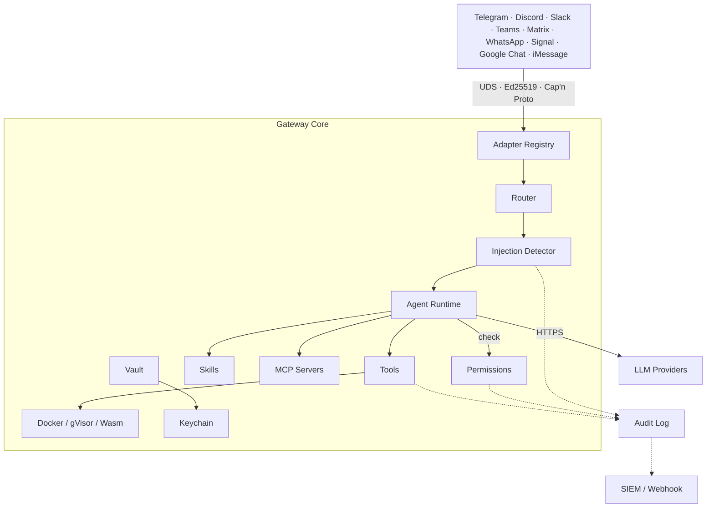

# Wirken

Wirken is a secure, model-agnostic AI agent gateway. It connects to the messaging platforms you already use — Telegram, Discord, Slack, Microsoft Teams, Matrix, WhatsApp, Signal, Google Chat, iMessage — and routes conversations to an LLM agent that can execute tools on your behalf. Written in Rust. Each channel runs as an isolated process with its own Ed25519 identity, communicating with the gateway over Unix domain sockets using Cap'n Proto. Credentials are encrypted at rest with XChaCha20-Poly1305, keyed from the OS keychain. All agent actions are logged to an append-only, hash-chained audit trail before execution. Ships as a single static binary.

## Install and run

Download the latest release binary:

```bash
curl -fsSL https://raw.githubusercontent.com/gebruder/wirken/main/install.sh | sh

wirken setup
wirken run
```

Prebuilt binaries are available for Linux (x86_64, aarch64) and macOS (x86_64, Apple Silicon). The Linux binaries are statically linked against musl — no glibc dependency.

Or build from source (requires Rust 1.85+ and the `capnp` compiler):

```bash
# Ubuntu/Debian
sudo apt-get install -y capnproto

# macOS
brew install capnp

cargo install --path crates/cli
```

`wirken setup` walks you through three steps:

```
  wirken setup
  ────────────

  Step 1: Pick your AI
  Provider: Ollama (local) / Anthropic / OpenAI / Google Gemini / AWS Bedrock / Tinfoil / Privatemode / Custom endpoint
  API key: ********
  Encrypting API key...
  API key encrypted and stored.
  Model: gpt-4.1-mini               ← auto-detected from provider API

  Step 2: Pick your channels
  Add a channel: Telegram
  Telegram bot token: ********
  telegram: token encrypted, adapter keypair generated, registered.

  Setup complete!
  Provider: openai (gpt-4o)
  Channels: telegram
```

`wirken run` starts the gateway daemon. It spawns adapter processes, accepts authenticated connections, routes messages to the agent, and serves a WebChat UI at `http://localhost:18790`:

```
  wirken gateway
  ──────────────

  Provider: ollama/llama3.2
  Ollama version: 0.19.0
  Route: telegram -> agent:default
  Socket: ~/.wirken/sockets/gateway.sock
  WebChat: http://localhost:18790

  Gateway running. Press Ctrl+C to stop.
```

Install as a system service so the gateway starts on login:

```bash
wirken setup --install-service
```

## Architecture



Each channel adapter runs as a separate OS process. Adapters authenticate to the gateway with a per-adapter Ed25519 challenge-response handshake over a Unix domain socket. Messages are serialized with Cap'n Proto (zero-copy, traversal-limited). An adapter can only deliver inbound messages for its own channel and request outbound sends for its own channel. It cannot invoke tools, read other channels' sessions, or access other channels' credentials.

This isolation is enforced at the type level. Session handles are parameterized by a channel marker type (`SessionHandle<Telegram>`), and the Rust compiler rejects any attempt to use a Telegram session handle in a Discord context. If an adapter process is compromised, the blast radius is exactly one channel — the gateway's IPC boundary, running in a separate memory-safe process, prevents lateral movement.

## Security properties

Designed against the [OWASP Top 10 for Agentic AI](https://genai.owasp.org/resource/agentic-ai-threats-and-mitigations/).

| OWASP | Threat | Mitigation |
|-------|--------|------------|
| AG01 | Excessive agency | Three-tier permission model. Tier 1 (always allowed): workspace file access, web search. Tier 2 (first-use approval, remembered 30 days): shell exec, external file access. Tier 3 (always prompt): destructive ops, credential access, network requests, skill install. |
| AG02 | Code execution | Docker sandbox: ephemeral containers, no-network, 512MB memory, 256 PID limit, non-root user. gVisor sandbox: same constraints with kernel attack surface reduction via `runsc` runtime. Wasm sandbox: compiled skill modules run in Wasmtime with fuel-based CPU limits, no filesystem, no network. Shell exec timeout at 300s. |
| AG04 | Tool misuse | Tool inputs validated against JSON schema. Workspace path confinement — file operations canonicalized and rejected if outside workspace boundary. |
| AG05 | Identity spoofing | Per-adapter Ed25519 challenge-response handshake over Unix domain sockets. Compile-time channel isolation — `SessionHandle<Telegram>` and `SessionHandle<Discord>` are different types; the compiler rejects cross-channel access. |
| AG07 | Multi-agent manipulation | Each channel adapter runs as a separate OS process. If an adapter is compromised, the blast radius is one channel. IPC boundary prevents lateral movement. |
| AG08 | Runaway loops | Agent tool call loop capped at 20 rounds per turn. Shell exec timeout at 300s. Rate limiting on all sources including loopback — no localhost exemption. |
| AG09 | Insufficient logging | Every agent action logged to an append-only SQLite log before execution. SHA-256 hash chain for tamper detection. 90-day retention with configurable pruning. Real-time SIEM forwarding to Datadog, Splunk, or webhook. Prompt injection detection flags inbound messages with threat indicators. Permission denials logged with full context: tool, tier, agent, trigger message. |
| — | Credential security | XChaCha20-Poly1305 encryption at rest, keyed from OS keychain (macOS Keychain / libsecret / age fallback). Per-credential expiry and rotation. `secrecy` + `zeroize` — logging or serializing a secret is a compile error. Key material zeroed after use. |
| — | Transport security | HTTPS enforced at transport level for all LLM and Matrix connections (non-localhost). Cap'n Proto IPC with 16MB frame limit, 512M word traversal limit, 64-level nesting limit. |
| — | Supply chain | Skill signatures verified against registry-provided Ed25519 key, not a bundled key. Release binaries include SHA-256 checksums; installer verifies before installing. CI runs clippy with `-D warnings`, fmt check, and full test suite on every push. |
| — | Confidential inference | Tinfoil and Privatemode providers run open-source LLMs inside hardware TEEs (AMD SEV-SNP, Intel TDX, NVIDIA H100 CC). Prompts encrypted end-to-end, protected against software attacks on infrastructure. |

## Enterprise deployment

Wirken gives organizations the controls they need to deploy AI agents without bypassing existing security, compliance, and audit requirements.

- **Full attribution.** Every agent action is tied to a user, channel, session, and agent. The audit log records who triggered what, when, and on which target.
- **Tamper-evident audit trail.** All actions logged before execution. SHA-256 hash chain detects modification or deletion. SIEM forwarding sends events to Datadog, Splunk, or any webhook in real time for centralized monitoring.
- **Graduated permissions.** Three-tier model. Workspace file access and web search are always allowed. Shell exec and external file access require first-use approval. Destructive operations, credential access, and skill installs always require explicit approval. Approvals expire after 30 days.
- **Sandboxed execution.** Optional Docker sandbox runs agent commands in ephemeral containers with no network access, memory and PID limits, and a non-root user. gVisor runtime available for kernel attack surface reduction.
- **Prompt injection detection.** Inbound messages are scanned for role-switching attempts, instruction overrides, base64-encoded commands, tool-call injection, and system prompt extraction. Detected threats are flagged in the audit log and forwarded to SIEM — messages are not blocked.
- **Confidential inference.** Tinfoil and Privatemode providers run LLMs inside hardware enclaves (AMD SEV-SNP, Intel TDX). Prompts are encrypted end-to-end and protected against software attacks on infrastructure.
- **Encrypted credentials.** XChaCha20-Poly1305 vault keyed from the OS keychain. Per-credential expiry and rotation. No plaintext export.
- **Centralized policy.** `wirken setup --org https://wirken.corp.example.com` pulls provider, SIEM, MCP, and permission config from a company endpoint. Developers get grab-and-go setup. IT manages one config. Policy refreshes on every `wirken run`.

## Status

17 crates, 316 tests, 8 LLM providers, 9 channel adapters, 15 bundled skills. CI on every push. Release binaries for Linux and macOS.

## Documentation

- [Getting started](docs/getting-started.md)
- [CLI reference](docs/cli.md)
- [Configuration reference](docs/configuration.md)
- [Channel setup](docs/channels.md) (Telegram, Discord, Slack, Teams, Matrix, Signal, Google Chat, iMessage)
- [Multi-agent setup](docs/multi-agent.md)
- [Skills guide](docs/skills.md) (markdown skills, Wasm skills, registry)
- [MCP setup](docs/mcp.md)
- [Enterprise deployment](docs/enterprise.md) (org config, SIEM, sandbox)
- [Troubleshooting](docs/troubleshooting.md)
- [Architecture](docs/architecture.md)
- [Enforcement model](docs/enforcement-model.md) (compile-time vs. runtime guarantees)

## Migrating from OpenClaw

Most OpenClaw skills are `SKILL.md` files — markdown with YAML frontmatter that the LLM reads as system prompt context. These copy directly into `~/.wirken/skills/` and work without modification. Wirken reads the same frontmatter contract: `name`, `description`, `metadata.openclaw.requires.bins`.

Credentials must be re-entered — Wirken does not import plaintext credential files. Run `wirken setup` and enter your API keys and bot tokens. They are encrypted immediately into the vault.

See [docs/migration.md](docs/migration.md) for a detailed migration guide.

## Contributing

Wirken is a Rust workspace. All crates compile and test independently:

```bash
cargo test              # run all 316 tests
cargo test -p wirken-vault    # test one crate
cargo build -p wirken-cli     # build the binary
```

Building from source requires the Cap'n Proto compiler (`capnproto` package on Ubuntu, `capnp` via Homebrew on macOS).

The architecture is documented in [docs/architecture.md](docs/architecture.md).

**Adapter contributions are especially welcome.** Each adapter is an independent crate (`crates/adapter-<channel>/`) that implements the same IPC contract: connect to the gateway UDS, perform Ed25519 handshake, convert platform messages to/from Cap'n Proto frames. See any existing adapter for the pattern — Telegram is the simplest, Teams shows the HTTP webhook variant.

## The name

Wirken: German, *to work*, *to weave*, *to have effect*. Named for [Gebruder Ottenheimer](https://gebruder.ottenheimer.app/briefs/wirken.html), a weaving mill in Wurttemberg, 1862-1937.

## License

MIT
