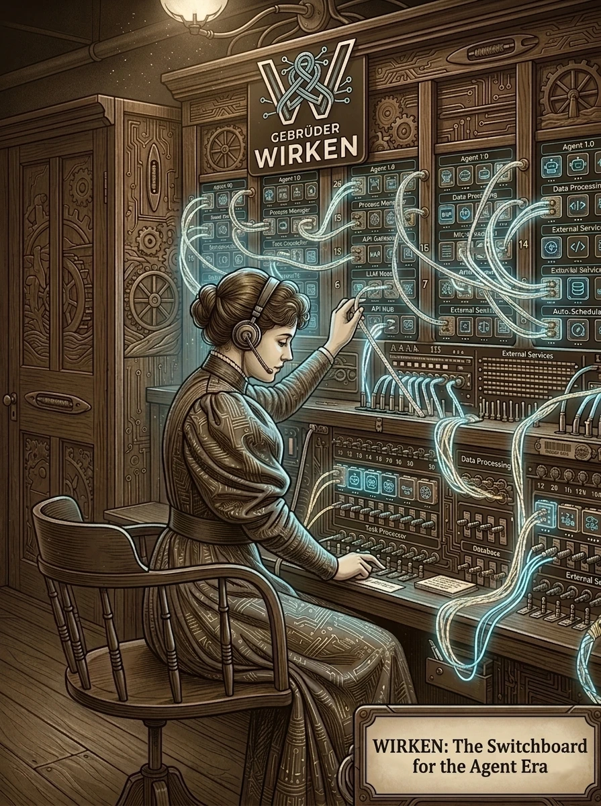
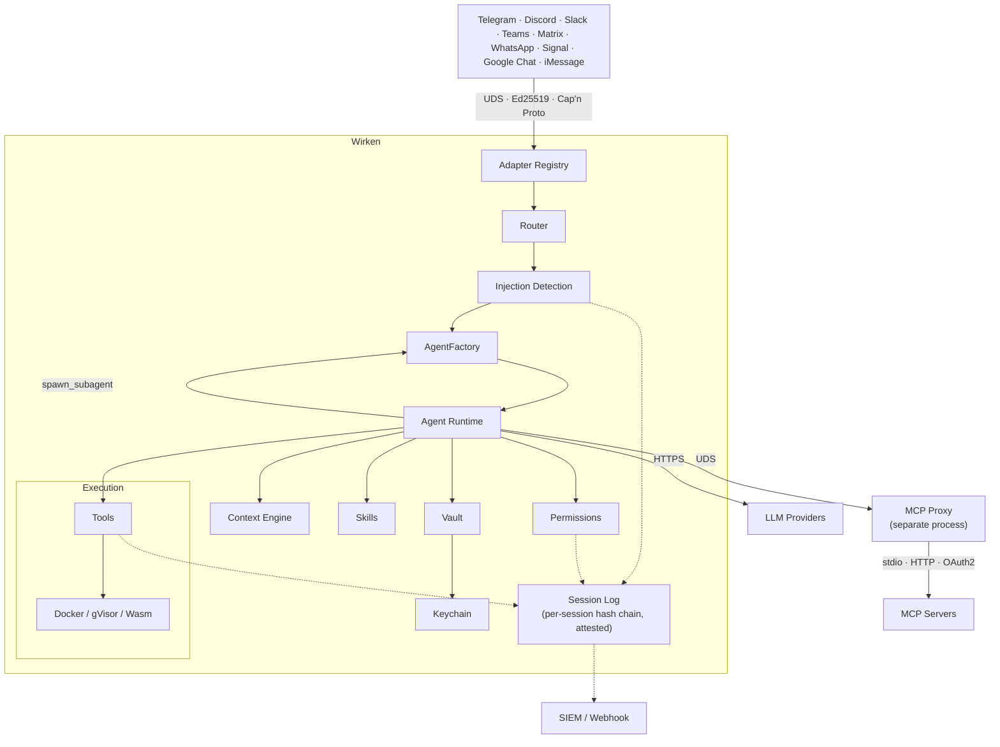

# Wirken

[](LICENSE) [](https://github.com/gebruder/wirken/actions/workflows/ci.yml) [](https://github.com/gebruder/wirken/releases)



Wirken is the switchboard for the agent era: shared infrastructure that lets a whole team put AI agents to work through the tools they already use. Your people message it on Telegram, Slack, Microsoft Teams, Discord, Matrix, WhatsApp, Signal, Google Chat, or iMessage, and the agent on the other end reads files, calls APIs, and runs tools on their behalf. Each channel gets its own line.

Wirken is built for the security team that has to answer for what those agents do. It assumes any agent can be turned against you: credentials never reach the model, each channel is isolated with its own identity, every action is attributed to the person who triggered it, and nothing runs unlogged. The signed, hash-chained audit log forwards to your SIEM, and every agent runs under least-privilege limits you set.

It ships as a single static Rust binary, so it runs wherever your controls require: a locked-down workstation, a server inside your network, or an air-gapped host. Point it at whatever models fit the same policy: local weights through Ollama, the Tinfoil or Privatemode confidential enclaves, Infomaniak's Swiss-hosted models including the open Apertus family, a commercial API such as OpenAI, Anthropic, Gemini, or Bedrock, or any OpenAI-compatible endpoint of your own. Local machine or remote, local model or hosted, the data boundary is yours to draw. MIT licensed.

Each channel runs in its own adapter process with a distinct Ed25519 IPC identity and its own vault-scoped token set. Credentials sit in an XChaCha20-Poly1305 vault keyed from the OS keychain, with per-credential expiry and manual rotation tracked in the store. Every agent action, tool call, LLM request, and response is written to a per-session SHA-256 hash-chained audit log. The log forwards to Datadog, Splunk HEC, Microsoft Sentinel, or a webhook when SIEM is configured. A separate OpenTelemetry projection ships GenAI semantic-convention spans over OTLP/HTTP+JSON to any OTLP-compatible backend; Microsoft documents a direct OTLP contract for non-SDK Agent 365 integration, which this projection implements (see [`docs/integrations/agent365.md`](docs/integrations/agent365.md) for the wire shape and the per-release verification gate). Permissions follow a three-tier model scoped per agent. Parent agents that spawn children declare per-child ceilings: tool allowlist, maximum permission tier, max rounds, max runtime.

## Install and run

Download the latest release binary:

```bash
curl -fsSL https://raw.githubusercontent.com/gebruder/wirken/main/install.sh | sh

wirken setup
wirken run
```

Pin the installer before piping. The committed `install.sh` has this SHA-256:

```
73e678196ea073608e902c8ab11a01ede07e0d37fddccaa20c43fa5d62bd52f5
```

Verify it yourself:

```bash
curl -fsSL https://raw.githubusercontent.com/gebruder/wirken/main/install.sh | sha256sum
```

The installer then fetches `checksums.sha256` and `checksums.sha256.sig` from the release, verifies the signature with `ssh-keygen -Y verify` against a signing key embedded in the script, and verifies the binary's SHA-256 against the signed checksums. Every failure path is fail-closed: missing signature, missing checksum, mismatched digest, or a machine without `sha256sum`/`shasum` aborts install. The only override is `WIRKEN_ALLOW_UNVERIFIED=1`, which warns on stderr and is documented in [docs/release-signing.md](docs/release-signing.md).

Prebuilt binaries are available for Linux (x86_64, aarch64), macOS (x86_64, Apple Silicon), and Windows 11 (x86_64). The Linux binaries are statically linked against musl with no glibc dependency. Windows users: the bash installer above does not apply; see [docs/windows.md](docs/windows.md) for the Windows install path and the feature-set differences (Signal adapter, orchestrator-push, service installer, and cron presets are Linux/macOS only).

`wirken setup` walks you through six steps:

```
  wirken setup
  ────────────

  Wirken is the switchboard between your messaging channels and an
  AI agent you control. Credentials never reach the LLM. Every
  action is logged in a signed, hash-chained audit log.

  Setup walks through six steps: provider, channels, credentials,
  service, sandbox, audit. About a minute.

  Continue [Y/n]: y

  ... (six interactive steps) ...

  Setup complete!

  Provider: anthropic (claude-sonnet-4-6)
  Channels: Telegram

  Next steps:
    wirken channel add <channel>      Add another messaging channel
    wirken credentials add <name>     Add or rotate a key
    wirken doctor                     Verify the install
    wirken sessions list              See active conversations

  WebChat: http://localhost:18790

  Start wirken: wirken run
```

`wirken run` starts wirken. It spawns adapter processes, accepts authenticated connections, routes messages to the agent, and serves a WebChat UI at `http://localhost:18790`:

```
  wirken v1.13.0
  ──────

  Provider: ollama/llama3.2
  Ollama version: 0.19.0
  Route: Telegram -> agent:default
  WebChat: http://localhost:18790

  Wirken running. Press Ctrl+C to stop.
```

All local services bind to 127.0.0.1. Wirken never instructs you to bind inference servers, WebChat, or any local endpoint to 0.0.0.0.

Install as a system service so wirken starts on login:

```bash
wirken setup --install-service
```

## Uninstall

Removing the data directory is irreversible and destroys the signed, hash-chained audit log along with it. If any retention or compliance need applies, export the audit chain **before** you delete anything:

```bash
wirken audit log --format json > wirken-audit-export.json   # one-shot JSON snapshot
cp ~/.wirken/audit.db wirken-audit-backup.db                 # or copy the raw hash-chained DB
```

Then uninstall in order. The service and cron steps call the `wirken` binary, so run them before removing it:

```bash
# 1. Stop and remove the system service. Removes the systemd user unit
#    ~/.config/systemd/user/wirken.service on Linux, or the launchd agent
#    ~/Library/LaunchAgents/app.ottenheimer.wirken.plist on macOS.
wirken setup --uninstall-service

# 2. Remove any scheduled preset cron entries (leaves your own cron lines
#    intact). Repeat per installed preset, e.g. zirkel:
wirken preset unschedule zirkel

# 3. Remove the binary.
rm "${WIRKEN_INSTALL_DIR:-$HOME/.local/bin}/wirken"

# 4. Remove the data directory. Deletes the credential vault, the age-file
#    device key, and the audit chain. Irreversible.
rm -rf ~/.wirken
```

Residue the steps above do not touch:

- **Shell profile**: if you exported `WIRKEN_VAULT_PASSPHRASE` in `~/.bashrc`, `~/.zshrc`, or a similar file, delete that line.
- **OS keychain**: the default release build keeps the vault device key in the age-file keychain under `~/.wirken/keychain/`, which step 4 removes. Only a build with the `keychain-macos` or `keychain-linux` feature stores it in the OS keychain instead. In that case remove it by hand. On macOS, the generic-password items under service `dev.wirken.vault` (account `device-key`, plus one aux entry per auxiliary key, for example `alarm-log-hmac`). On Linux, the Secret Service items with attribute `application=wirken` (the device key is labeled `wirken-device-key`).
- **Platform-side registrations**: local deletion does not touch state you created at each messaging platform. Remove or revoke it there:
  - **iMessage (BlueBubbles)**: the adapter registers a callback webhook on your BlueBubbles server (`POST <bluebubbles_url>/api/v1/server/webhooks`). Delete it in the BlueBubbles server's webhook settings.
  - **Bots, apps, and tokens** you created stay live until you remove them at the platform: the Slack app and its bot/app tokens (Slack admin), the Telegram bot token (BotFather; the adapter long-polls, so there is no webhook to clear), the WhatsApp Cloud API app and its configured webhook URL (Meta App Dashboard), the Discord bot application (Discord Developer Portal), the Teams bot registration (Azure), the Matrix bot account (its homeserver), the Signal linked device (unlink it on the phone), and the Google Chat app. Rotating these credentials is prudent regardless, since they were held in the vault.

Windows uses different paths and a smaller feature set (no service installer or cron presets); see [docs/windows.md](docs/windows.md).

## Architecture



Each channel adapter runs as a separate OS process. Adapters authenticate to the gateway with a per-adapter Ed25519 challenge-response handshake over a Unix domain socket. Messages are serialized with Cap'n Proto (zero-copy, traversal-limited). An adapter can only deliver inbound messages for its own channel and request outbound sends for its own channel. It cannot invoke tools, read other channels' sessions, or access other channels' credentials.

Channel isolation operates at two levels. The active mechanism is process-level: each channel runs in its own OS process with a distinct ed25519 identity. The IPC crate also defines a sealed `Channel` trait and `SessionHandle<C: Channel>` type that makes cross-channel handle conversions a compile error. This type-level API is not yet threaded through the production message path, where the channel discriminator is a string field on the Cap'n Proto inbound frame. If an adapter process is compromised, the blast radius is exactly one channel because the gateway's IPC boundary, running in a separate memory-safe process, prevents lateral movement.

The MCP proxy also runs out-of-process over a Unix domain socket, with the vault handle isolated in the proxy. MCP servers connect via stdio, HTTP, or OAuth2, and the agent process never sees MCP credentials.

Two distinct boundaries protect MCP credentials. **Process isolation** is per-MCP-server-config: every server entry in `mcp.json` spawns its own subprocess at the wirken UID, with its own stdin/stdout pipe and its own environment, and the agent process never holds plaintext bearer tokens or OAuth2 client secrets — those live behind the proxy's vault handle. **Vault ACLs** are per-credential-name: the credential store keys every entry by name (e.g. `slack-token`, `github-pat`), and a connector that asks for a credential it was not configured for receives a `NotFound` rather than a value from another connector's slot. The two are independent. A compromised MCP child cannot read another child's credentials because process isolation keeps every child to its own configured token set; a compromised credential name cannot be retrieved by an unrelated component because the vault store gates by name. Neither alone is sufficient, and the combination is what gives the MCP path its credential-scoping property.

Agents are stateless between turns. The `AgentFactory` wakes an agent for each inbound message by replaying its session log. Conversations are durably logged as typed session events (user messages, assistant messages, tool calls, tool results, LLM request/response metadata) in an append-only, per-session hash-chained table. If the agent crashes mid-turn, the harness detects incomplete tool rounds on wake and surfaces them as failures rather than silently re-executing side effects. A context engine trims conversations under each model's token budget before every LLM call, preferring to drop old tool results before touching user or assistant text.

Agents can delegate bounded subtasks to child agents via `spawn_subagent`. The operator configures a per-child capability ceiling (tool allowlist, max permission tier, max rounds, max runtime). Children run headless with no interactive approvals, isolated session logs, and a hard depth cap of 4.

## Security properties

- **Session attestation.** Per-agent Ed25519 identity signs the per-session hash chain after every turn. `wirken sessions verify` replays the log offline and re-checks message hashes, deterministic tool results, and chain integrity. Tampered sessions break the chain.
- **Reproducible replay.** Every LLM call is recorded as a typed session event with a SHA-256 hash of the exact messages and tools sent. The verifier recomputes these hashes from the log and flags any divergence.
- **Per-channel process isolation.** Each channel adapter runs in its own OS process with a distinct ed25519 identity. Type-level channel separation (`SessionHandle<Telegram>` vs `SessionHandle<Discord>`) exists in the IPC crate and is regression-tested but not yet used in the production message path.
- **Out-of-process credential isolation.** MCP credentials (bearer tokens, OAuth2 client secrets) live in a separate proxy process. The agent process never sees them. The vault is XChaCha20-Poly1305, keyed from the OS keychain; `secrecy` + `zeroize` make logging a secret a compile error.
- **Capability-attenuated multi-agent.** The LLM cannot widen a child agent's permissions. The operator sets the ceiling; the harness intersects, clamps, and enforces. Children run headless with no interactive approvals.

A handful of operator-controlled escape hatches relax specific
defaults: `WIRKEN_ALLOW_UNSIGNED_ORG_CONFIG=1`,
`WIRKEN_ALLOW_UNSIGNED_SKILLS=1`, `sandbox.json` mode `off`,
`WIRKEN_WEBCHAT_ALLOW_NO_ORIGIN=1`, and
`WIRKEN_AUDIT_VERIFY_EVERY_FLUSHES=N` (the last raises the
continuous-verify cadence; values above 10,000 effectively disable
the in-process verifier and emit a warn). Each is documented under
"Documented escape hatches" in the security-properties doc. Persistent flips need a
systemd `EnvironmentFile`, shell `rc` export, or wrapper script so the
operator's intent is durable across reboots.

Full OWASP and NIST AI RMF mappings: [docs/security-properties.md](docs/security-properties.md)

## Enterprise deployment

Wirken gives organizations the controls they need to deploy AI agents without bypassing existing security, compliance, and audit requirements.

- **Full attribution.** Every inbound message records the platform sender id, channel, session, and agent. Permission decisions are scoped per agent, not per user. Typed session events record what action ran, when, and on which target.
- **Tamper-evident audit trail.** All actions logged as typed session events before execution. Per-session SHA-256 hash chain detects modification or deletion. Per-agent Ed25519 attestation signs the chain head after every turn. `wirken sessions verify` replays the log offline and re-checks hashes. SIEM forwarding sends events to Datadog, Splunk HEC, Microsoft Sentinel, or any webhook in real time. A separate OpenTelemetry projection ships GenAI semconv spans over OTLP/HTTP+JSON to any OTLP-compatible backend; Microsoft documents a direct OTLP contract for non-SDK Agent 365 integration, which this projection implements. The per-release verification gate is described in [`docs/integrations/agent365.md`](docs/integrations/agent365.md).
- **Crash recovery.** Agents are stateless between turns. The harness replays the session log on wake. Incomplete tool rounds are detected and surfaced as failures rather than silently re-executed.
- **Graduated permissions.** Three-tier model. Workspace file access and web search are always allowed. Shell exec and external file access require first-use approval. Destructive operations, credential access, and network requests always require explicit approval. Approvals expire after 30 days. Skill installs are gated by registry-anchored signature verification, not by the tier system; the gate runs at `wirken skills install` time and again at every `SkillLoader::load_file` call, with `WIRKEN_ALLOW_UNSIGNED_SKILLS=1` as the documented opt-out.
- **Capability-attenuated multi-agent.** Parent agents delegate to children via `spawn_subagent` under operator-configured ceilings (tool allowlist, max permission tier, max rounds, max runtime). Children run headless with isolated session logs. Hard depth cap of 4.
- **Sandboxed execution.** Shell exec runs in an ephemeral Docker container by default (exec-only mode as of 0.7.5). Containers drop all Linux capabilities, set `no-new-privileges`, use Docker's default seccomp profile, use a read-only root filesystem with a 64 MB tmpfs at `/tmp`, pin memory and PIDs, and run as a non-root user with no network. gVisor (runsc) is opt-in for kernel attack surface reduction. If Docker is not reachable, the ToolRegistry logs a distinct warning and refuses `exec` (fail-closed) for the agent's lifetime rather than falling back to host execution; if runsc is requested but not registered, the warning names that dependency specifically. Sandbox provisioning is lazy, so there is no startup cost when unused. Operators who set `sandbox.json` to `mode: off` opt into running `exec` at the wirken UID with no container; the gateway warns at startup, and the host shell can then read or rewrite trust files under the data directory. See [docs/security-properties.md](docs/security-properties.md) for the full posture.
- **Egress allowlist scope.** The skill-set `egress.domains` list applies to the built-in `web_search` and `generate_image` tools. It does **not** apply to the `exec` shell sink (curl/wget run as the host shell), to MCP server children (which open their own outbound connections), or to the LLM HTTP client (which talks to the configured provider directly). Operators wanting hard egress control should run wirken inside a network namespace, restricted-egress container, or with OS-level firewall rules. See [`docs/egress.md`](docs/egress.md) for the full scope and mitigation guidance, and [`crates/agent/src/egress.rs`](crates/agent/src/egress.rs) for the source.
- **Context management.** A per-model context engine trims conversations under token budgets before every LLM call, preferring to drop old tool results before touching user or assistant text. Structured compaction events are written to the session log and projected back into the prompt so the model knows what was trimmed.
- **Prompt injection detection.** Inbound messages are scanned for role-switching attempts, instruction overrides, base64-encoded commands, tool-call injection, and system prompt extraction. Detected threats are flagged in the session log and forwarded to SIEM; messages are not blocked.
- **Confidential inference.** Tinfoil and Privatemode providers run LLMs inside hardware enclaves (AMD SEV-SNP, Intel TDX). Tinfoil dispatch goes through the [tinfoil-rs SDK](https://github.com/tinfoilsh/tinfoil-rs) so each session gates on AMD SEV-SNP hardware attestation plus Sigstore code-provenance verification, and chat traffic flows over a TLS connection pinned to the attested certificate. See the [Tinfoil reference instance](docs/reference/tinfoil.md) and the [Privatemode reference instance](docs/reference/privatemode.md) for the end-to-end trust models and deployment recipes.
- **Encrypted credentials.** XChaCha20-Poly1305 vault keyed from the OS keychain. Per-credential expiry and rotation. No plaintext export. MCP credentials are isolated in a separate proxy process.
- **Centralized policy.** `wirken setup --org https://wirken.corp.example.com` pulls provider, SIEM, MCP, and permission config from a company endpoint. Developers get grab-and-go setup. IT manages one config. Policy refreshes on every `wirken run`.

## Documentation

- [Getting started](docs/getting-started.md)
- [Deploying for teams](docs/deploying-for-teams.md) (shared inference, per-channel adapters, current limitations)
- [Permissions and identity](docs/permissions-and-identity.md) (what exists today, what is planned)
- [CLI reference](docs/cli.md)
- [Configuration reference](docs/configuration.md)
- [Channel setup](docs/channels.md) (Telegram, Discord, Slack, Teams, Matrix, Signal, Google Chat, iMessage)
- [Multi-agent setup](docs/multi-agent.md)
- [Skills guide](docs/skills.md) (markdown skills, Wasm skills, registry)
- [Lyrik overview](docs/lyrik-overview.md) (security-assessment skill — what it is and why)
- [MCP setup](docs/mcp.md)
- [Security properties](docs/security-properties.md) (OWASP and NIST AI RMF mappings)
- [Enterprise deployment](docs/enterprise.md) (org config, SIEM, sandbox)
- [Microsoft Agent 365 integration](docs/integrations/agent365.md) (OpenTelemetry projection, wire contract, Tier A and Tier B verification framing)
- [Migration from OpenClaw](docs/migration.md)
- [Troubleshooting](docs/troubleshooting.md)
- [Architecture](docs/architecture.md)
- [Enforcement model](docs/enforcement-model.md) (compile-time vs. runtime guarantees)
- [Release process](docs/release-process.md) (version bump, tag, sign, publish, smoke test)
- [Release signing](docs/release-signing.md) (Ed25519 key, rotation, verification)

## Contributing

Wirken is a Rust workspace. All crates compile and test independently:

```bash
cargo test                        # full test suite
cargo test -p wirken-vault        # test one crate
cargo build -p wirken-cli         # build the binary
```

Building from source needs a recent stable Rust toolchain and the Cap'n Proto compiler. Install `capnp` via your package manager (`apt-get install -y capnproto` on Ubuntu, `brew install capnp` on macOS, `choco install capnproto -y` on Windows), then `cargo install --path crates/cli`.

The architecture is documented in [docs/architecture.md](docs/architecture.md).

**Adapter contributions are especially welcome.** Each adapter is an independent crate (`crates/adapter-<channel>/`) that implements the same IPC contract: connect to the gateway UDS, perform Ed25519 handshake, convert platform messages to/from Cap'n Proto frames. See any existing adapter for the pattern (Telegram is the simplest; Teams shows the HTTP webhook variant).

## Status

Only the latest release is supported. Security fixes ship forward in the next release rather than as backports to older versions. See [SECURITY.md](SECURITY.md).

- **9 channel adapters** under `crates/adapter-*`: Telegram, Discord, Slack, Microsoft Teams, Matrix, WhatsApp, Signal, Google Chat, iMessage.
- **8 LLM providers** in `crates/agent/src/llm.rs`: Ollama, Anthropic, OpenAI, Google Gemini, AWS Bedrock, Tinfoil, Privatemode, plus a `custom` provider for any OpenAI-compatible endpoint.
- **Bundled skills** under `skills/`.
- **Workspace tests** green on main (`cargo test --workspace`).
- **Signed releases.** `checksums.sha256` is signed offline with an Ed25519 SSH key. `install.sh` embeds the public key inline, fetches `checksums.sha256.sig` from the release, and fails closed on any verification failure. See [docs/release-signing.md](docs/release-signing.md) and [KEYS](KEYS).

## The name

Wirken: German, *to work*, *to weave*, *to have effect*. Named for [Gebruder Ottenheimer](https://gebruder.ottenheimer.app/briefs/wirken.html), a weaving mill in Wurttemberg, 1862-1937.

## License

MIT
