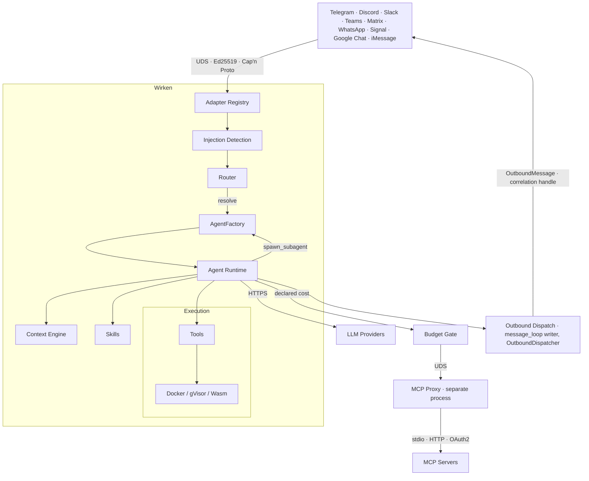
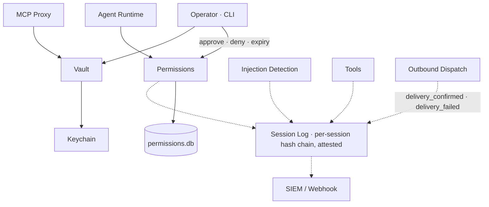

# Wirken

[](LICENSE) [](https://github.com/gebruder/wirken/actions/workflows/ci.yml) [](https://github.com/gebruder/wirken/releases)


Wirken is the enterprise gateway for autonomous agents: the switchboard
between your team's messaging channels and the AI agents working on their
behalf. Your people reach it from a browser or the chat platforms they already
use, and the agent on the other end reads files, calls APIs, and runs tools
for them. Each channel gets its own line.

Wirken is built for the security team that has to answer for what those agents
do. It assumes any agent can be turned against you, and boxes in what a
compromised one can reach.

It ships as a single static Rust binary, so it runs wherever your controls
require: a locked-down workstation, a server inside your network, or an
air-gapped host. Its model connection is provider-agnostic: frontier APIs,
local weights through Ollama, TEEs for encrypted processing, or Swiss- and
EU-hosted endpoints, all interchangeable. Each agent runs the model you assign
it, capped by a per-agent spend budget. MIT licensed.

## How it works

A message comes in on a channel, Wirken wakes an agent to handle it, and every
file it reads, API it calls, and tool it runs passes through Wirken's controls
first.

- **The agent is untrusted.** The guarantees below do not depend on the model
  behaving, whether it is carrying a prompt-injection payload or drifting over
  a long session.
- **Credentials never reach the model.** Tokens and keys stay in an
  [encrypted vault](docs/credentials.md). Wirken supplies them at the edge; the
  agent and the LLM never see them.
- **Every action is logged before it runs, and attributed.** Each step is
  written to a [signed, hash-chained audit log](docs/audit-cli.md) as a typed
  event, tagged with the person who triggered it, before it executes.
- **Least privilege by default.** A [three-tier permission
  model](docs/permissions-and-identity.md), and any sub-agent an agent spawns
  is boxed by limits you set.
- **Shell commands run in a sandbox.** Anything the agent executes runs in an
  [ephemeral container](docs/sandbox-properties.md) with no network. If the
  sandbox is unavailable, execution is refused rather than run on the host.

## Install

Prerequisites: Linux (x86_64 or aarch64), macOS (Intel or Apple Silicon), or
Windows 11 (x86_64); at least one model endpoint; and Docker if you want shell
commands sandboxed, which is the default. Without Docker the agent simply
cannot run shell commands and nothing else is affected.

```bash
curl -fsSL https://raw.githubusercontent.com/gebruder/wirken/main/install.sh | sh

wirken setup
wirken run
```

Pin the installer before piping. The committed `install.sh` has this SHA-256:

```
73e678196ea073608e902c8ab11a01ede07e0d37fddccaa20c43fa5d62bd52f5
```

```bash
curl -fsSL https://raw.githubusercontent.com/gebruder/wirken/main/install.sh | sha256sum
```

What the installer verifies, and how to check a release by hand:
[docs/signing.md](docs/signing.md#release-signing).

Prebuilt binaries cover Linux (x86_64, aarch64), macOS (x86_64, Apple
Silicon), and Windows 11 (x86_64). The Linux binaries are statically linked
against musl with no glibc dependency. The bash installer does not apply on
Windows; see [docs/windows.md](docs/windows.md) for that path and the
feature-set differences.

`wirken run` spawns adapter processes, accepts authenticated connections,
routes messages to the agent, and serves a WebChat UI at
`http://localhost:18790`:

```
  wirken v1.24.0
  ──────

  Provider: ollama/llama3.2
  Ollama version: 0.19.0
  Route: Telegram -> agent:default
  WebChat: http://localhost:18790

  Wirken running. Press Ctrl+C to stop.
```

All local services bind to 127.0.0.1. Wirken never instructs you to bind
inference servers, WebChat, or any local endpoint to 0.0.0.0.

**Running modes.** Interactive (`wirken run` in the foreground), browser (the
same command serves WebChat), as a service (`wirken setup --install-service`
installs a systemd user unit or launchd agent), or scheduled (`wirken preset
schedule <name>` runs preset agents on a cron schedule with no human in the
loop, under the same permission and audit controls). Service and scheduled
modes are Linux and macOS only.

## Uninstall

Removing the data directory destroys the audit log with it. Export first if
any retention need applies:

```bash
wirken audit log --format json > wirken-audit-export.json
cp ~/.wirken/audit.db wirken-audit-backup.db
```

Then, in order, because the first two steps call the binary:

```bash
wirken setup --uninstall-service          # systemd unit or launchd plist
wirken preset unschedule zirkel           # repeat per installed preset
rm "${WIRKEN_INSTALL_DIR:-$HOME/.local/bin}/wirken"
rm -rf ~/.wirken                          # vault, device key, audit chain
```

Residue those steps do not touch: a `WIRKEN_VAULT_PASSPHRASE` line in your
shell profile; OS keychain items, if you built with the `keychain-macos` or
`keychain-linux` feature rather than the default age-file backend; and the
bots, apps and tokens you created at each platform, which stay live until you
remove them there. See [docs/channels.md](docs/channels.md#platform-side-state).

## Architecture

Each channel runs as its own isolated process. The gateway is the only
component that holds credentials and writes the audit log. The agent is
stateless: it is woken for each message and rebuilt from its session log.

The message path, inbound to outbound:



Who approves, who holds secrets, and what reaches the record:



The reasoning behind each boundary is in
[docs/architecture.md](docs/architecture.md); which guarantees the compiler
enforces and which are runtime policy is in
[docs/enforcement-model.md](docs/enforcement-model.md).

## Known limitations

Wirken contains the blast radius of a compromised agent; it does not make
compromise impossible. The honest edges:

- **Egress is not fully contained.** Sandboxed `exec` is bounded, but MCP
  server children and the LLM client open their own outbound connections and
  need a network namespace, a restricted-egress container, or firewall rules.
  See [docs/egress.md](docs/egress.md).
- **The sandbox can be turned off.** With `sandbox.json` set to `mode: off`,
  `exec` runs at the Wirken UID with no container, and the host shell can then
  read or rewrite trust files under the data directory. The gateway warns at
  startup.
- **Audit tamper-evidence assumes an out-of-band anchor.** The hash chain and
  signature detect modification, but a same-UID attacker who rewrites both the
  log and the local public key is only caught if you verify against a key kept
  off the machine.
- **Injection detection flags, it does not block.** Suspicious inbound
  messages are marked and forwarded to your SIEM, not stopped. The permission
  tiers and the sandbox are what limit what an injected agent can do.
- **Type-level channel isolation is not in the hot path.** Channel separation
  is enforced at the process level; the compile-time `SessionHandle<Channel>`
  API exists and is tested but is not threaded through the production message
  path.
- **Agents share the gateway's address space.** Channel adapters are separate
  processes; agents are not.
- **Permissions are per agent, not per user.** A Tier 2 approval granted by
  one sender applies to every sender on that agent until it expires.
- **Escape hatches exist.** A handful of environment flags relax defaults.
  Each is documented and warns when engaged; the full inventory is in
  [docs/security-properties.md](docs/security-properties.md#documented-escape-hatches).

## Documentation

**Start here**
[Getting started](docs/getting-started.md) ·
[CLI reference](docs/cli.md) ·
[Configuration](docs/configuration.md) ·
[Channels](docs/channels.md) ·
[Troubleshooting](docs/troubleshooting.md) ·
[Windows](docs/windows.md)

**Security**
[Security properties](docs/security-properties.md) (OWASP and NIST mappings, escape hatches) ·
[Permissions and identity](docs/permissions-and-identity.md) ·
[Audit](docs/audit-cli.md) ·
[Sandbox properties](docs/sandbox-properties.md) ·
[Egress](docs/egress.md) ·
[Signing](docs/signing.md) ·
[Enforcement model](docs/enforcement-model.md)

**Operating**
[Deploying for a team](docs/enterprise.md) ·
[Multiple agents](docs/multi-agent.md) ·
[Credentials and OAuth scopes](docs/credentials.md) ·
[Cost monitoring](docs/cost-monitoring.md) ·
[Getting the chain out](docs/siem-forwarder.md) (SIEM, hooks, OpenTelemetry) ·
[Imported archives](docs/imported-archives.md)

**Extending**
[Skills](docs/skills.md) ·
[MCP setup](docs/mcp.md) ·
[Lyrik](docs/lyrik.md) (security-assessment skill) ·
[Zirkel](docs/zirkel.md) (research aggregator preset)

**Maintaining**
[Architecture](docs/architecture.md) ·
[Release process](docs/release-process.md)

## Contributing

Wirken is a Rust workspace. All crates compile and test independently:

```bash
cargo test                        # full test suite
cargo test -p wirken-vault        # test one crate
cargo build -p wirken-cli         # build the binary
```

Building from source needs a recent stable Rust toolchain and the Cap'n Proto
compiler (`apt-get install -y capnproto`, `brew install capnp`, or
`choco install capnproto -y`), then `cargo install --path crates/cli`.

**Adapter contributions are especially welcome.** Each adapter is an
independent crate (`crates/adapter-<channel>/`) implementing the same IPC
contract: connect to the gateway UDS, perform the Ed25519 handshake, convert
platform messages to and from Cap'n Proto frames. Telegram is the simplest;
Teams shows the HTTP webhook variant.

## The name

Wirken: German, *to work*, *to weave*, *to have effect*. Named for
[Gebruder Ottenheimer](https://gebruder.ottenheimer.app/briefs/wirken.html), a
weaving mill in Wurttemberg, 1862-1937.

## License

MIT
