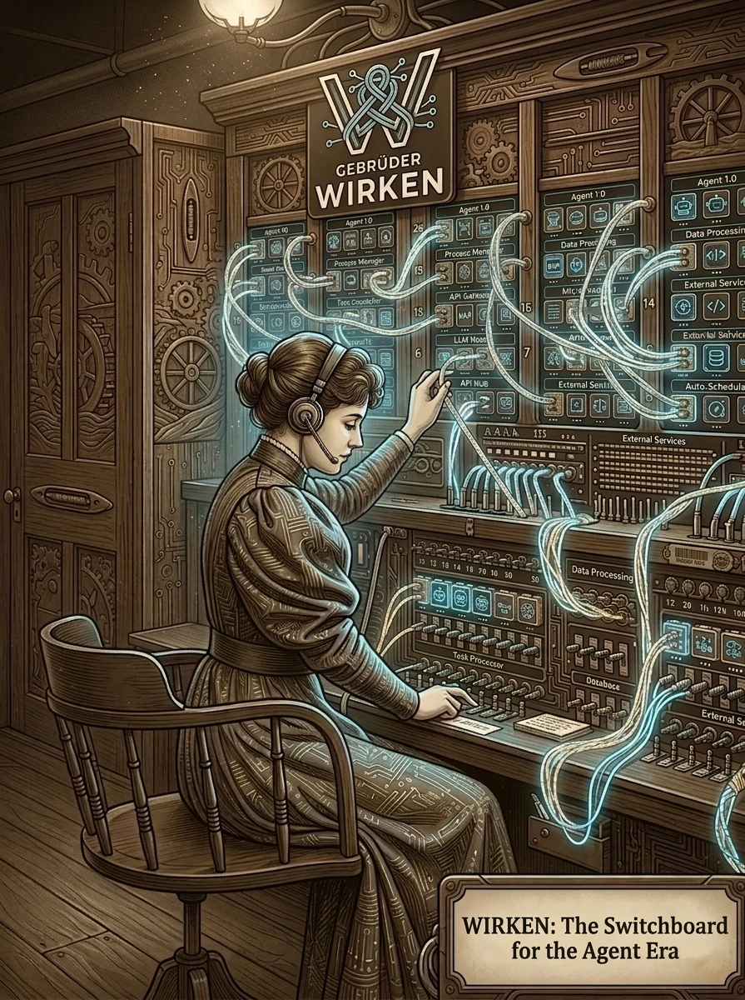
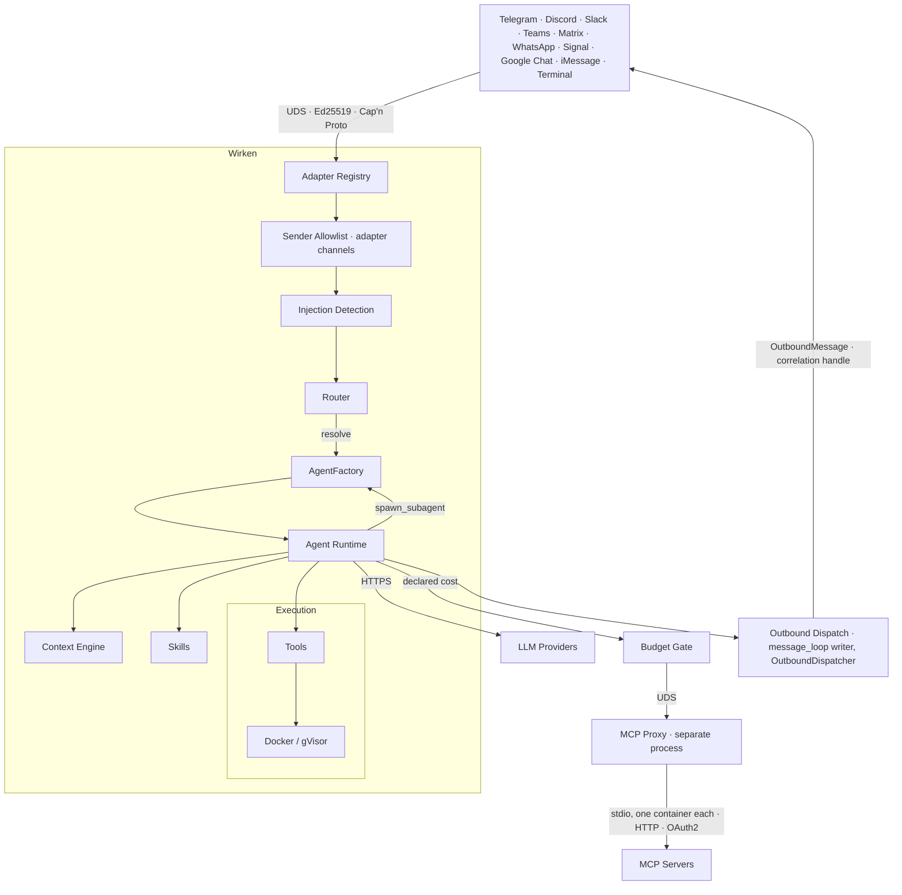
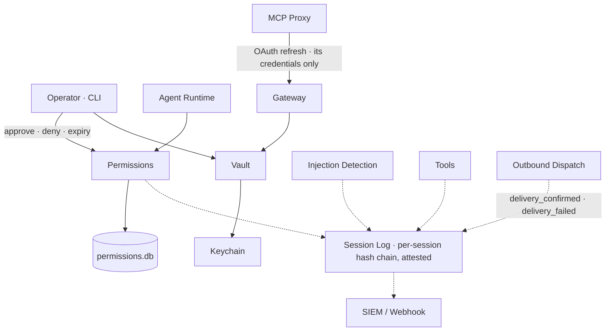

# Wirken

[](LICENSE) [](https://github.com/gebruder/wirken/actions/workflows/ci.yml) [](https://github.com/gebruder/wirken/releases)



Wirken is the enterprise gateway for autonomous agents: the switchboard
between your team's messaging channels and the AI agents working on their
behalf. Your people reach it from a browser or the chat platforms they already
use, and the agent on the other end reads files, calls APIs, and runs tools
for them. Each channel gets its own line.

Wirken is built for the security team that has to answer for what those agents
do. It assumes any agent can be turned against you, and boxes in what a
compromised one can reach.

It ships as a single static Rust binary, so it runs wherever your controls
require: a locked-down workstation, a server inside your network, or an
air-gapped host. Its model connection is provider-agnostic: frontier APIs,
local weights through Ollama, TEEs for encrypted processing, Swiss- and
EU-hosted endpoints, or a ChatGPT plan the operator has, all
interchangeable. Each agent runs the model you assign it. A per-agent budget
can alert on or refuse calls past a ceiling, in USD or, for a local model
with no price, in seconds of model time; it is off until configured. MIT
licensed.

## How it works

A message comes in on a channel, Wirken wakes an agent to handle it, and every
file it reads, API it calls, and tool it runs passes through Wirken's controls
first.

- **The agent is untrusted.** The guarantees below do not depend on the model
  behaving, whether it is carrying a prompt-injection payload or drifting over
  a long session.
- **Credentials never reach the model.** Tokens and keys stay in an
  [encrypted vault](docs/credentials.md). Wirken supplies them at the edge; the
  agent and the LLM never see them.
- **Every action is logged and attributed.** Each tool call is written to a
  [hash-chained audit log with signed chain heads](docs/audit-cli.md) as a
  typed event, tagged with the sender who triggered it, before it executes.
  Its outcome is written after it.
- **Least privilege by default.** A [three-tier permission
  model](docs/permissions-and-identity.md), and any sub-agent an agent spawns
  is boxed by limits you set.
- **Shell commands run in a sandbox.** By default, anything the agent executes
  runs in an [ephemeral container](docs/sandbox-properties.md) with no network.
  `wirken agents set-egress` grants a channel's commands
  [proxied egress](docs/egress.md#sandbox-egress), and `sandbox.json` can turn
  networking on or the container off. If the sandbox is unavailable, execution
  is refused rather than run on the host.

## Install

Prerequisites: Linux (x86_64 or aarch64), macOS (Intel or Apple Silicon), or
Windows 11 (x86_64); at least one model endpoint; and Docker if you want shell
commands sandboxed, which is the default. Without Docker the agent cannot run
shell commands, and stdio MCP servers do not start: each one runs in its own
container unless its `mcp.json` entry sets `"sandbox": "off"` to run it on the
host ([docs/mcp.md](docs/mcp.md)).

```bash
curl -fsSL https://raw.githubusercontent.com/gebruder/wirken/main/install.sh | sh

wirken setup
wirken run
```

Pin the installer before piping. The committed `install.sh` has this SHA-256:

```
085faf0359384403e4e80d1e75734b84cec7ce92182d9012c7879f9bc681fb70
```

```bash
curl -fsSL https://raw.githubusercontent.com/gebruder/wirken/main/install.sh | sha256sum
```

What the installer verifies, and how to check a release by hand:
[docs/signing.md](docs/signing.md#release-signing).

Prebuilt binaries cover Linux (x86_64, aarch64), macOS (x86_64, Apple
Silicon), and Windows 11 (x86_64). The Linux binaries are statically linked
against musl with no glibc dependency. The bash installer does not apply on
Windows; see [docs/windows.md](docs/windows.md) for that path and the
feature-set differences.

`wirken run` spawns adapter processes, accepts authenticated connections,
routes messages to the agent, and serves a WebChat UI at
`http://127.0.0.1:18790`; log in with `wirken webchat open --browser`:

```
  wirken v3.3.1
  ──────

  Provider: ollama/llama3.2
  Ollama version: 0.19.0
  Route: Telegram -> agent:default
  WebChat: http://127.0.0.1:18790 (log in with `wirken webchat open`)

  Wirken running. Press Ctrl+C to stop.
```

All local services bind to 127.0.0.1. Wirken never instructs you to bind
inference servers, WebChat, or any local endpoint to 0.0.0.0.

**Running modes.** Interactive (`wirken run` in the foreground), browser (the
same command serves WebChat), in the terminal (`wirken chat`, a channel of
the running gateway), as a service (`wirken setup --install-service`
installs a systemd user unit or launchd agent), or scheduled (`wirken preset
schedule <name>` runs preset agents on a cron schedule with no human in the
loop, under the same permission and audit controls). Service and scheduled
modes are Linux and macOS only.

## Try the demo

1. Install wirken with `install.sh`, as above.
2. Start Docker.
3. `git clone https://github.com/gebruder/wirken && cd wirken`
4. Run `scripts/demo/stage.sh up`, then `scripts/demo/stage.sh ask`; [scripts/demo/README.md](scripts/demo/README.md) is the runbook.

Lyrik on code you don't trust: [docs/lyrik.md](docs/lyrik.md#running-on-code-you-dont-trust)
lists each protection a Lyrik run has against a hostile target and the test
that proves it. From the clone, on Linux with `git` and util-linux `script`:

```bash
cargo test -p wirken-cli --test lyrik_team_files_stay_locked --test lyrik_run_reaches_no_network \
  --test lyrik_provenance_runs_nothing_the_repo_configures --test lyrik_exec_sandbox_only \
  --test lyrik_signoff --test lyrik_inference_matches_the_chain
```

## Uninstall

Removing the data directory destroys the audit log with it. Export first if
any retention need applies:

```bash
wirken audit log --all --format json > wirken-audit-export.json
cp ~/.wirken/audit.db wirken-audit-backup.db
```

Then, in order, because the first two steps call the binary:

```bash
wirken setup --uninstall-service          # systemd unit or launchd plist
wirken preset unschedule zirkel           # repeat per installed preset
rm "${WIRKEN_INSTALL_DIR:-$HOME/.local/bin}/wirken"
rm -rf ~/.wirken                          # vault, device key, audit chain
```

Residue those steps do not touch: a `WIRKEN_VAULT_PASSPHRASE` line in your
shell profile; OS keychain items, if you built with the `keychain-macos` or
`keychain-linux` feature rather than the default age-file backend; and the
bots, apps and tokens you created at each platform, which stay live until you
remove them there. See [docs/channels.md](docs/channels.md#platform-side-state).

## Architecture

Each channel runs as its own process and starts with only its own
credentials, which the gateway hands it at spawn. The gateway holds the vault
and is the only process that opens it: the MCP proxy, too, starts with the
credentials its MCP configs name handed over at spawn, and asks the gateway to
refresh OAuth tokens. No process the gateway starts holds the vault passphrase.
The
gateway writes the audit log, and the MCP proxy appends its server-verification
and server-lifecycle rows. Each stdio MCP server runs in its own container,
started and restarted by the MCP proxy. The agent is stateless: it is woken for each message and rebuilt from its
session log.

The message path, inbound to outbound:


```mermaid
graph TD
    Channels["Telegram · Discord · Slack · Teams · Matrix · WhatsApp · Signal · Google Chat · iMessage · Terminal"]
    Channels -- "UDS · Ed25519 · Cap'n Proto" --> Registry[Adapter Registry]

    subgraph Wirken
        Registry --> Senders["Sender Allowlist · adapter channels"]
        Senders --> Detect[Injection Detection]
        Detect --> Router
        Router -- "resolve" --> Factory[AgentFactory]
        Factory --> Agent[Agent Runtime]
        Agent --> Context[Context Engine]
        Agent --> Skills
        Agent --> Tools

        subgraph Execution
            Tools --> Sandbox[Docker / gVisor]
        end
    end

    Agent -- "spawn_subagent" --> Factory
    Agent -- HTTPS --> LLM[LLM Providers]
    Agent -- "declared cost" --> Budget[Budget Gate]
    Budget -- "UDS" --> McpProxy["MCP Proxy · separate process"]
    McpProxy -- "stdio, one container each · HTTP · OAuth2" --> McpServers[MCP Servers]

    Agent --> Outbound["Outbound Dispatch · message_loop writer, OutboundDispatcher"]
    Outbound -- "OutboundMessage · correlation handle" --> Channels
```

Who approves, who holds secrets, and what reaches the record:


```mermaid
graph TD
    Operator["Operator · CLI"] -- "approve · deny · expiry" --> Permissions
    Permissions --> PermsDb[("permissions.db")]
    Operator --> Vault --> Keychain
    Agent[Agent Runtime] --> Permissions
    McpProxy[MCP Proxy] -- "OAuth refresh · its credentials only" --> Gateway --> Vault

    Detect[Injection Detection] -.-> SessionLog
    Permissions -.-> SessionLog
    Tools -.-> SessionLog
    Outbound["Outbound Dispatch"] -. "delivery_confirmed · delivery_failed" .-> SessionLog
    SessionLog["Session Log · per-session hash chain, attested"] -.-> SIEM[SIEM / Webhook]
```

The reasoning behind each boundary is in
[docs/architecture.md](docs/architecture.md); which controls are checked at
compile time and which at run time is in
[docs/enforcement-model.md](docs/enforcement-model.md).

## What Wirken contains

- **Channels.** Each channel adapter is a separate OS process that is handed
  only its own credentials. Agents run inside the gateway process.
- **Shell.** By default `exec` runs in a container with no network, the agent
  workspace as its only mount, no capabilities and a seccomp profile.
  `wirken agents set-egress` and `sandbox.json` change the network and the
  mode ([egress.md](docs/egress.md#sandbox-egress)). If the container runtime
  the sandbox mode names is not available, `exec` is refused.
- **Approvals.** The tier of a tool call is computed from the tool name and
  arguments, not by the model. Workspace file access does not prompt.
  Twenty-three inspection commands prompt unless the operator has recorded a
  grant. Every other command and every MCP call prompts each time.
- **Audit.** Each session is a hash-chained log with signed chain heads.
  `wirken audit verify --require-signed --anchor <key>` checks it against a
  key kept off the machine.

What is outside these controls, and under which settings, is stated once in
[docs/threat-model.md](docs/threat-model.md#boundaries). The environment
flags that relax a default are listed in
[docs/security-properties.md](docs/security-properties.md#documented-escape-hatches).

## Lyrik

Lyrik records every candidate it declines with the rule and reason. A rejected candidate stays in `findings.json` under `rejected_candidates` and in SARIF as a suppressed result, and the run prints the rejections by rule at its end. The eight rules, and how the `mode` key in `.lyrik/config.json` decides whether a rejection demotes or removes a finding, are in [docs/lyrik-brocards.md](docs/lyrik-brocards.md).

## Documentation

**Start here**
[Getting started](docs/getting-started.md) ·
[CLI reference](docs/cli.md) ·
[Configuration](docs/configuration.md) ·
[Channels](docs/channels.md) ·
[Troubleshooting](docs/troubleshooting.md) ·
[Updating](docs/update.md) ·
[Windows](docs/windows.md)

**Security**
[Security properties](docs/security-properties.md) (OWASP and NIST mappings, escape hatches) ·
[Permissions and identity](docs/permissions-and-identity.md) ·
[Audit](docs/audit-cli.md) ·
[Sandbox properties](docs/sandbox-properties.md) ·
[Egress](docs/egress.md) ·
[Signing](docs/signing.md) ·
[Enforcement model](docs/enforcement-model.md) ·
[Threat model](docs/threat-model.md)

**Operating**
[Deploying for a team](docs/enterprise.md) ·
[Multiple agents](docs/multi-agent.md) ·
[Credentials and OAuth scopes](docs/credentials.md) ·
[Cost monitoring](docs/cost-monitoring.md) ·
[Getting the chain out](docs/siem-forwarder.md) (SIEM, hooks, OpenTelemetry) ·
[Imported archives](docs/imported-archives.md)

**Extending**
[Skills](docs/skills.md) ·
[MCP setup](docs/mcp.md) ·
[Lyrik](docs/lyrik.md) (security-assessment skill) ·
[Zirkel](docs/zirkel.md) (research aggregator preset)

**Maintaining**
[Architecture](docs/architecture.md) ·
[Release process](docs/release-process.md)

## Contributing

Wirken is a Rust workspace. All crates compile and test independently:

```bash
cargo test                        # full test suite
cargo test -p wirken-vault        # test one crate
cargo build -p wirken-cli         # build the binary
```

Building from source needs a recent stable Rust toolchain and the Cap'n Proto
compiler (`apt-get install -y capnproto`, `brew install capnp`, or
`choco install capnproto -y`), then `cargo install --path crates/cli`.

**Adapter contributions are especially welcome.** Each adapter is an
independent crate (`crates/adapter-<channel>/`) implementing the same IPC
contract: connect to the gateway UDS, perform the Ed25519 handshake, convert
platform messages to and from Cap'n Proto frames. Telegram is the simplest;
Teams shows the HTTP webhook variant.

## The name

Wirken: German, *to work*, *to weave*, *to have effect*. Named for
[Gebruder Ottenheimer](https://gebruder.ottenheimer.app/briefs/wirken.html), a
weaving mill in Wurttemberg, 1862-1937.

## License

MIT
