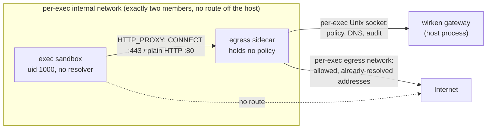

# Egress

The skill-set `egress.domains` allowlist is a defense-in-depth control on a specific set of agent built-in tools, not a network boundary. This page documents what `egress.domains` covers, what it does not, and where operators bound the gaps.

## What `egress.domains` covers

`EgressClient` mediates outbound HTTP for four built-in agent paths:

- `web_search`: the agent's web-search tool.
- `generate_image`: the agent's image-generation tool.
- `http_request`: the agent's general HTTP tool. See [The `http_request` gate](#the-http_request-gate) below.
- The Zirkel daily-fetch transport: `wirken zirkel run` uses an `EgressClient` constructed with an explicit `RateLimitConfig` so per-source daily budgets apply.

Each call resolves the request host against the agent's effective `egress.domains` allowset (the union of every loaded skill's `egress.domains` declaration). Hosts not in the allowset are denied pre-flight, before any TCP connection and without consuming the rate-limit budget. Wildcard `"*"` is supported on the allowset; `"*.example.com"` style suffix patterns are also supported.

With no skill allow-set declared, which is an agent with no skills attached
and the state of a fresh install, `http_request` reaches no host: every
request is refused pre-flight and recorded as `SkillPermissionDenied`. A host
becomes reachable only when a loaded skill names it, or when a skill declares
`egress.domains: ["*"]`. `web_search` and `generate_image` do not take a host
from the model: `web_search` posts to DuckDuckGo and `generate_image` to the
configured provider's image endpoint. With no skills attached those two are
not restricted.

Source: `EgressClient::check_egress` (host-based check) and `EgressClient::check_egress_declared` (the no-allow-set refusal for `http_request`) in `crates/agent/src/egress.rs`; `merge` in `crates/agent/src/skill_perms.rs` (allowset resolution).

## The `http_request` gate

`http_request` is Tier 1, so the interactive approval flow adds no prompt
while the session has read nothing restricting. Authorization is the skill's
own permissions block plus an operator-set credential binding, and every
failure of those is a refusal recorded as `SkillPermissionDenied`. Four checks
run before the request is built (`crates/agent/src/http_tool.rs::gate`, called
from `Agent::execute_tool` in `crates/agent/src/runtime.rs`):

- **Method.** `GET`, `HEAD`, `POST` only.
- **`tools.allow`** must contain `http_request`.
- **`http.post_paths`** must contain the exact host and path for a POST,
  query string ignored. Some REST APIs expose search as a POST; this is the
  only write-shaped verb the tool permits, and only to a pre-declared
  endpoint.
- **`credentials.allow`** must contain any vault slot named in the call. The
  model names a slot by string and never supplies a secret value.

A request that clears all four still goes out through `EgressClient`, so the
host allowset above applies on top.

Once the session has read something restricting, which is every read label but
`aggregated_external` (workspace files, either channel's memory, an imported
archive), a request whose host clears the allowset goes to the operator first,
as sandboxed `exec` egress does. The operator is asked about the destination
at Tier 3 (`NetworkRequest`, keyed by host), the answer is recorded as
`PermissionApproved` or `PermissionDenied`, and an approval covers that one
call. With no operator reachable, cron or a headless sub-agent, the request is
refused. With no skills attached there is no
allowset, and `http_request` refuses every host; only an explicit
`egress.domains: ["*"]` admits a host no skill named.

### Credential-host binding

A credential is bound to permitted hosts in the vault, by the operator:

```bash
wirken credentials add records-api --host records.example.org
```

The resolver checks the request host against the credential's stored
`allowed_hosts` (exact, case-insensitive) before returning the secret, so a
request to any other host is refused and the secret is never injected,
whatever the skill's `egress.domains` allows. A credential with no `--host`
is unusable by `http_request` at all. The effective destination set is the
intersection of the operator's binding and the skill's allowlist: a skill
can narrow it, never widen it.

This is the control that keeps the tool safe at Tier 1. Without it,
authorization would be the skill's own frontmatter, and a phished skill
update pairing `credentials.allow: [api-key]` with
`egress.domains: [attacker.example]` would exfiltrate the bearer token with
no prompt.

The resolved secret is injected as exactly one `Authorization: Bearer`
header and then dropped. It is never stored on a struct, formatted into a
returned string, logged, or audited; the audit row carries the slot name
only. The returned `headers` map excludes `Authorization` and
`Proxy-Authorization`. A model that puts either header in `headers` itself
gets a refusal rather than a silent strip.

Source: `crates/agent/src/http_tool.rs`, `CredentialMetadata::permits_host`
(`crates/vault/src/store.rs`), `VaultCredentialResolver`
(`crates/cli/src/commands/run.rs`).

## What `egress.domains` does not cover

Three outbound paths bypass `EgressClient` entirely and are not constrained by skill-side allowlists. The `exec` sink has its own separate control, described under [Sandbox egress](#sandbox-egress); the other two are bounded only by the operator's network config.

### `exec` shell sink

When the agent invokes the `exec` tool, the shell runs the command inside the sandbox container. Anything that command does (`curl https://attacker.example.com`, `wget`, `nc`, and so on) goes through the container's network namespace, not through `EgressClient`. The skill-side `egress.domains` allowlist is not consulted for this path; sandbox egress is a separate axis, described under [Sandbox egress](#sandbox-egress) below.

Under `mode: off` the shell runs on the host directly and has no network bound at all. That mode is opt-in and requires explicit operator firewalling (`iptables`, `nftables`, `pf`) if the shell must be constrained.

### MCP servers

A stdio MCP server runs in its own container with `--network none`, unless its signed `mcp.json` entry lists `sandbox.egress.hosts`; then it reaches those hosts through its own sidecar, as described under [MCP server egress](#mcp-server-egress) below. `egress.domains` is not consulted for either.

Two kinds of MCP traffic are outside that boundary:

- **HTTP MCP servers.** `wirken-mcp-proxy` connects to the entry's `url` itself, from the host.
- **`"sandbox": "off"`.** A stdio server whose entry turns the sandbox off runs as a host process at the wirken UID and opens its own outbound connections directly through the OS.

**Mitigation for those two.** Same as the `exec` sink under `mode: off`: OS-level network controls. Install MCP servers only from trusted sources, and pin versions in `mcp.json`.

### LLM HTTP client

The agent's LLM client uses its own `reqwest::Client` so traffic to the configured provider always works regardless of the operator's egress posture for skill tools. The provider host is gated by `provider.json::base_url` (and by the bound channel-override `base_url` for channel-specific overrides) but not by `egress.domains`.

This is deliberate: an `egress.domains` rule that accidentally excludes the provider would break the agent entirely with a vague tool-side error, when the right place to enforce provider-host policy is the operator's network config.

**Mitigation.** Provider choice plus network controls. For TEE-backed providers (Tinfoil, Privatemode), end-to-end encryption to the enclave gives an additional confidentiality layer that does not depend on the network path.

## Sandbox egress

Sandboxed `exec` has its own egress axis, configured per channel on the agent's `AgentConfig::channel_egress` and enforced at the container boundary rather than in `EgressClient`. It is independent of `egress.domains`: a skill-side allowlist grants nothing to the shell, and a channel egress allowlist grants nothing to `web_search` or `http_request`.

### Modes

| Mode | Container networking | Reach |
| --- | --- | --- |
| `none` | `--network none` | Nothing. No proxy is started. |
| `allowlist` | Internal network, proxy only | Domains matching the channel's `domains` list. |
| `open` | Internal network, proxy only | Any domain, still subject to the port and address rules below. |

`none` is the default and the posture every unresolved case lands on: a channel with no entry, a turn with no channel (cron, CLI `ask`), an unrecognized mode string, and a stored policy blob that no longer parses. `open` is reachable only by writing it explicitly.

Source: `crates/agent/src/sandbox_egress.rs` (exec's policy), `crates/sandbox/src/egress.rs` (the sidecar, the broker and the rules every request is held to), `crates/sandbox/src/egress_net.rs` (the networks and the sidecar container), `crates/gateway/src/agent_config.rs::ChannelEgress`.

### Configuring

```bash
# Grant one channel a domain allowlist.
wirken agents set-egress work --channel slack \
  --mode allowlist --domains "api.example.com,*.internal.example"

# Any domain, still bounded to 443/80 and still refusing IP literals.
wirken agents set-egress work --channel slack --mode open

# Revoke: back to no networking at all.
wirken agents set-egress work --channel slack --mode none

# Granted channels appear under their agent.
wirken agents list
```

The channel must already be bound to the agent; egress on an unbound channel would never take effect, so that is refused rather than stored. Unknown modes, IP literals, entries carrying a scheme, port, path, or credentials, `--domains` without `allowlist`, `allowlist` without `--domains`, and mixing `*` with specific hosts are all rejected at config time. This is deliberately stricter than the runtime resolver, which fails closed silently: silence is right in the hot path and wrong at a prompt.

### Topology

In `allowlist` and `open` modes the exec runs alongside a per-exec **sidecar proxy container**. Two networks are created per exec:

- an `Internal` bridge with no route off the host, which the sandbox joins and nothing else;
- an ordinary bridge that only the sidecar joins, which is the sole path outward.

The isolation invariant on the internal network is that it is `Internal`, created per exec, and has exactly two members: the sandbox and its own sidecar. There is no third party to reach, and the network is destroyed when the exec ends. Inter-container communication is deliberately left enabled on it, because the sandbox reaching its sidecar is the one flow the network exists to carry.

The sandbox's only reachable peer is the sidecar, and the sidecar is the only thing that can reach the internet. A process that ignores `HTTP_PROXY` and opens a raw socket does not bypass the allowlist; it has nowhere to route.



The sidecar holds no policy. For each request it asks the gateway over a per-exec Unix socket bind-mounted into it, and receives either already-resolved addresses or a refusal. The sidecar runs as the operator's uid (uid 0 under a rootless runtime, which is the operator), so the socket is mode 0600 in a 0700 directory and no other local user can reach the broker. Policy, DNS resolution, the global-unicast filter, and the audit row all stay in the gateway process, so a compromised sidecar can misreport what it wants but cannot widen what it gets, and cannot forge attribution.

**No host port is involved anywhere.** The gateway listens on a Unix socket, which is a filesystem object, so a default-deny host firewall has no bearing on the path. This is verified on a host running ufw with default-deny inbound.

The sidecar runs the wirken binary itself, bind-mounted read-only, so there is no second artifact to ship or version. That requires the gateway binary to be the statically linked build, which is how releases ship. A dynamically linked development build cannot run inside the sandbox image; `sandbox.json`'s `sidecar_binary` points at a static build for those cases.

The sandbox has no working resolver: DNS is pinned to an address with nothing behind it, and it is handed the sidecar's address directly rather than a name.

### Properties

- **HTTP(S) or nothing.** `CONNECT` on 443 and plain HTTP on 80 are the only shapes proxied. There is no generic TCP forward, so SSH, database protocols, and raw sockets are unreachable from a sandbox whatever the allowlist says. A `CONNECT` to any other port is refused.
- **Domain match only.** IP-literal targets are refused before the allowlist is consulted, so an entry can never authorize a bare address. Matching reuses the same `host_in_set` helper as skill-side `egress.domains`, so `*` and `*.example.com` behave identically on both axes.
- **Resolved addresses are filtered.** After resolution, addresses outside global unicast are dropped: loopback, private, link-local (which covers the `169.254.169.254` metadata address), unique-local, and carrier-grade NAT. An allowlisted name whose DNS answer points inside the host's own network does not get connected to.
- **Attribution is structural.** Each exec gets its own listener carrying the agent, channel, adapter, and sender it was bound to. No field on a denial row is parsed out of request content, so a sandboxed process cannot forge its own attribution.

### Platform

The decision broker listens on a Unix socket, so `allowlist` and `open` are unix-only. On other platforms `provision_egress` refuses the `exec` rather than running it unproxied, and records the refusal on the hash chain as `SessionEvent::SandboxEgressUnsupported`. Tier `none` is unaffected and works everywhere.

### Runtime requirement

Verified on rootful Docker, on a host with a default-deny inbound firewall. If the sidecar cannot be started, does not report ready, or is not running when the sandbox is about to start, `exec` is refused rather than run unproxied.

### Known limit

`CONNECT` allowlisting is decided on the CONNECT target and the tunnel is not inspected after that. A client that connects to an allowlisted host and then presents a different SNI reaches whatever that host's address serves for the name. Where a shared-IP CDN fronts both an allowed and a denied origin, the allowlist is only as tight as that address. Closing this would require terminating TLS in the proxy, which this design deliberately does not do.

### Audit

Every request that reaches the proxy emits `SessionEvent::SandboxEgressVerdict` on the agent's hash-chained session log, allowed or not. A CONNECT tunnel is one request to the proxy, however many HTTP requests the client then sends inside it. The row carries the host, the port, `allowed`, the mode in force, the confidentiality labels the session had observed, whether a label changed the verdict, and the structural attribution. On a refusal it also carries a closed-set `reason`: `mode_none`, `not_allowed`, `ip_literal`, `port_not_allowed`, `method_not_allowed`, `malformed`, `resolution_failed`, or `sensitivity_refused`.

The platform refusal is a separate variant rather than a reason on this one, because nothing reached a proxy to have a verdict taken on it: `SessionEvent::SandboxEgressUnsupported` carries the mode and the attribution and no host.

Both variants are forwarded to a typed SIEM by default.

### MCP server egress

A contained stdio MCP server whose entry lists `sandbox.egress.hosts` gets the same topology, sidecar, broker protocol and properties as an `exec` under `allowlist`, with these differences:

- **Policy.** The allowlist is the entry's `egress.hosts`, inside the signed entry hash, so widening it breaks the signature. `*` allows any domain name, still bounded by the port and address rules. There is no confidentiality stage: the proxy has no session whose reads could condition the verdict.
- **Broker.** It runs in `wirken-mcp-proxy`, not the gateway.
- **Lifetime.** The sidecar and both networks are created before the server's container and live as long as it; they are removed when it stops or is restarted, and swept at the next proxy start if the proxy died.
- **Audit.** Each verdict is a `SandboxEgressVerdict` on the `gateway-mcp` session with `mcp_server` set to the server's name and `agent_id` to its agent; `channel`, `adapter_id` and `sender_id` are absent. `mode` is `allowlist`, or `open` when the hosts list `*`.
- **Runtime.** Refused on rootless Docker, Podman and Windows with `McpEntryRefused` reason `egress_unsupported_runtime`; the server does not start rather than start without its proxy.

Configuration and the rest of the containment: [mcp.md](mcp.md#network).

## Cross-reference

The same gap appears in [security-properties.md](security-properties.md) under T11 (Unexpected RCE and code attacks), where it is described as a code-execution surface rather than a configuration-side scope. The two pages describe the same constraint from different angles; if you are reading this page to evaluate a deployment, the T11 row carries the threat-model context.

## Source references

- `EgressClient` scope and host check: `EgressClient`, `EgressClient::check_egress` and `EgressClient::check_egress_declared` in `crates/agent/src/egress.rs`.
- Allowset and wildcard resolution: `merge` and `union_allow` in `crates/agent/src/skill_perms.rs`, matching in `host_in_set` in the same file and `host_matches` in `crates/sandbox/src/egress.rs`.
- MCP server egress: `McpEgressPolicy` and `check_host_pattern` in `crates/mcp-proxy/src/egress.rs`, `start_route` in `crates/mcp-proxy/src/container.rs`.
- Threat-model row: [security-properties.md](security-properties.md), row `T11` (Unexpected RCE and code attacks).
