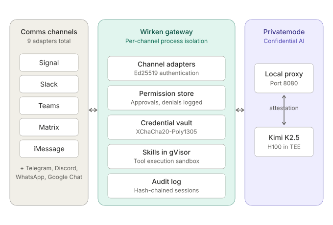

# Privatemode reference instance

> **Status: in development (tracked in [#57](https://github.com/gebruder/wirken/issues/57)).**
> This document specifies the target Wirken + Privatemode reference instance, aligned with the Privatemode 2.0 release (the v1.37 / v1.38 release cluster featuring Kimi K2.5, the browser web app, and separate input/output/cached token pricing). Sections marked _Today_ describe what ships in the current Wirken binary. Sections marked _Target_ describe work tracked in #57. Concrete specs (endpoints, flags, model IDs) are grounded in the Privatemode documentation at <https://docs.privatemode.ai/> and the source at <https://github.com/edgelesssys/privatemode-public>.

## What works today

Wirken already ships a Privatemode provider option. Running `wirken setup` and selecting Privatemode will:

- Prompt for the proxy URL (default `http://localhost:8080`) and access key.
- Encrypt the access key into the XChaCha20-Poly1305 vault alongside channel credentials.
- Configure the agent to call the Privatemode local proxy with OpenAI-shape requests at `POST /v1/chat/completions`, 128k context, tools enabled.

That path works end-to-end against a user-started `privatemode-proxy` container. What this reference instance adds: Anthropic-shape support, packaged sidecar recipes, an end-to-end integration test, loopback-only binding by default, and a round-trip verification procedure documented below.

## Architecture



Three trust zones, three enforcement mechanisms.

1. Channels do not trust each other. Enforcement: per-channel process isolation via Rust phantom types.
2. Tool execution is not trusted. Enforcement: gVisor sandbox.
3. Inference operator is not trusted. Enforcement: confidential computing attestation in the Privatemode local proxy. The proxy fetches a signed manifest from `cdn.confidential.cloud:443`, validates the remote TEE attestation (AMD SEV-SNP, Intel TDX, NVIDIA H100 CC), and establishes an end-to-end encrypted channel before forwarding any client request.

Stacked, the only parties who see plaintext are the end user and the TEE.

## Request flow

1. Message arrives at a channel adapter. Adapter authenticates to core with Ed25519.
2. Core loads channel-scoped credentials from the vault.
3. Skills run in the gVisor sandbox if tools are invoked.
4. Core emits an inference request to `privatemode-proxy` at `localhost:8080`.
5. Proxy has already attested the Privatemode backend. It encrypts the request, ships it to `api.privatemode.ai:443`, receives the encrypted response.
6. Proxy returns plaintext to Wirken.
7. Wirken routes the agent output back through the originating channel adapter.
8. Every transition is appended to the hash-chained audit log.

## API shape

Privatemode exposes both Anthropic-compatible and OpenAI-compatible surfaces on the same proxy. Privatemode does not designate either as primary — the choice is Wirken's.

| Shape | Proxy path | Supports |
|-------|------------|----------|
| OpenAI | `POST /v1/chat/completions` | Chat, tools, streaming |
| Anthropic | `POST /v1/messages` | Chat, streaming (SSE), `system` prompt, `max_tokens` required |
| OpenAI | `POST /v1/embeddings` | `qwen3-embedding-4b` only |
| OpenAI | `POST /v1/audio/transcriptions` | `whisper-large-v3`, `voxtral-mini-3b` |

All requests use `Content-Type: application/json`. The `--apiKey` flag on the proxy authenticates the proxy-to-backend leg; client requests to the local proxy need a non-empty `Authorization: Bearer <anything>` header but the value is not validated.

- _Today:_ Wirken uses OpenAI shape (`POST /v1/chat/completions`). See `crates/agent/src/llm.rs::privatemode()`.
- _Target:_ add Anthropic shape with selection via `api_shape = "anthropic" | "openai"` in provider config; default TBD (see [model choice](#models) below, since the Anthropic `/v1/messages` endpoint is newer in Privatemode — added in v1.37).

## Models

Verified against <https://docs.privatemode.ai/models/overview/> as of Privatemode v1.38.0.

| Model ID | Context | Tools | Vision | Status |
|----------|---------|-------|--------|--------|
| `kimi-k2.5` | 262k | Yes | Yes | Preview (v1.38 release note); models page shows stable |
| `gemma-3-27b` | 128k | Yes¹ | Yes | Stable |
| `gpt-oss-120b` | 128k | Yes | No | Stable |
| `qwen3-coder-30b-a3b` | 128k | Yes | No | **Deprecated** — migrate to `kimi-k2.5` |
| `qwen3-embedding-4b` | 32k | — | — | Stable (embeddings, 1024 or 2560 dim) |

¹ Gemma 3 cannot generate mixed text and tool outputs in the same response.

**Wirken's choice (target):** default model is `gpt-oss-120b` (stable, text-only, 128k, tools). `kimi-k2.5` is Privatemode's recommended flagship and is what their 2.0 messaging leads with; exposing it via config is required but pinning it as the default is deferred until the preview-vs-stable discrepancy in Privatemode's own docs is resolved. The full catalog above is selectable via `model = "..."` in the provider config.

## Credentials

_Today._ The Privatemode access key is stored in Wirken's XChaCha20-Poly1305 vault as a single inference credential. It is not channel-scoped — all channels share one inference backend.

_Target._ When Wirken spawns the proxy sidecar directly, the key is written to a mode-0600 tmpfile and passed via `--apiKey @/path/to/keyfile` (the `@` prefix tells the proxy to read from the file). This keeps the key out of `ps`-visible arguments and out of environment variables. When the proxy is managed externally (systemd, k8s), the operator is responsible for secret delivery.

## Deployment

_Today._ Users start `privatemode-proxy` themselves. The `wirken setup` wizard prints:

```
docker run -p 8080:8080 ghcr.io/edgelesssys/privatemode/privatemode-proxy:latest --apiKey <key>
```

**Security note:** the proxy itself binds `0.0.0.0:8080` by default. The docker flag above publishes that to all interfaces on the host. For a single-host deployment, users should bind the published port to loopback explicitly: `-p 127.0.0.1:8080:8080`.

_Target._ Packaged sidecar recipes in `deploy/privatemode/`:

- `systemd/privatemode-proxy.service` — single-host, key delivered via `LoadCredentialEncrypted=`, proxy invoked with `--apiKey @%d/apikey`. Port published to `127.0.0.1:8080` via `Requires=` chaining to a socket unit that binds loopback.
- `compose/docker-compose.yml` — single-host container deployment. `ports: ["127.0.0.1:8080:8080"]`. Key delivered via docker-compose secrets (`--apiKey @/run/secrets/privatemode_key`).
- Kubernetes operators should use Privatemode's upstream Helm chart at `privatemode-proxy/charts/privatemode-proxy/` in <https://github.com/edgelesssys/privatemode-public>. Wirken does not ship its own chart.

All three deployments run the proxy with manifest auto-fetch enabled (the default). Pinning via `--manifestPath` is not recommended for production per the upstream guide.

## Verifying a round-trip

_Target procedure:_

1. Start the proxy via the chosen recipe.
2. `wirken run` with `provider = "privatemode"`.
3. Send a message through a configured channel.
4. Confirm receipt of the agent response in the channel.
5. `wirken audit log` shows the inference request and response appended, including the Privatemode model ID, token counts, and the proxy's manifest digest at request time.
6. `wirken sessions verify` succeeds against the hash-chained log.

Steps 5 and 6 depend on audit/session tooling covered by the acceptance criteria in #57.

## Verified claims

Grounded in the Privatemode 2.0 launch email (2026-04-22) and the public release notes.

- Privatemode supports Anthropic `/v1/messages` as of release **v1.37.0**.
- Privatemode 2.0 bundles Kimi K2.5, the browser web app, and separate input/output/cached token pricing. The desktop app is deprecated in favor of the web app.
- Proxy attestation happens before Wirken sends any request. The proxy writes manifest transitions to `log.txt` in its workspace.
- `gpt-oss-120b` is stable with 128k context and tool calling (text-only, no vision).
- `kimi-k2.5` shipped in **v1.38.0** (2026-04-22) with 262k context and multimodal input. The release note labels it preview; the models overview page shows it stable. Treat as preview until the two sources agree.

## Known gotchas

- **`reasoning_content` deprecation**: removed from Anthropic-shape responses on 2026-05-01. If Wirken's audit writer records `reasoning_content` directly, it must switch to the supported field before that date.
- **Client-version cutoff**: Privatemode backends dropped support for clients older than v1.33 on 2026-04-17. Pin the proxy image to `:latest` or a release ≥ v1.33.
- **Cache token reporting**: Anthropic-shape responses from Privatemode do **not** return `cache_creation_input_tokens` separately; those tokens are folded into `input_tokens`. Audit records must not assume the field is present.
- **No Rust SDK**: Privatemode ships official SDKs at `sdk/js` and `sdk/wasm` in the public repo. Wirken speaks the documented HTTP API directly (`reqwest` against the local proxy).
- **Default bind**: the proxy binary binds `0.0.0.0` — loopback-only exposure is the deployer's responsibility via port publication (docker `-p 127.0.0.1:...`) or systemd socket activation.

## Gaps

- Per-channel inference provider selection is not yet implemented.
- Wirken does not verify Privatemode attestation independently; it trusts the proxy handshake.
- Kimi K2.5 preview status is ambiguous in Privatemode's own docs; default to `gpt-oss-120b` until the two sources agree.
- No integration test against a real proxy in CI. Acceptance in #57 requires a proxy stub or recorded cassettes.

## References

- Privatemode docs: <https://docs.privatemode.ai/>
- API overview: <https://docs.privatemode.ai/api/overview/>
- Anthropic endpoint: <https://docs.privatemode.ai/api/messages/>
- Proxy configuration guide: <https://docs.privatemode.ai/guides/proxy-configuration/>
- Models overview: <https://docs.privatemode.ai/models/overview/>
- Release notes: <https://docs.privatemode.ai/release/>
- Public source (MIT): <https://github.com/edgelesssys/privatemode-public>
